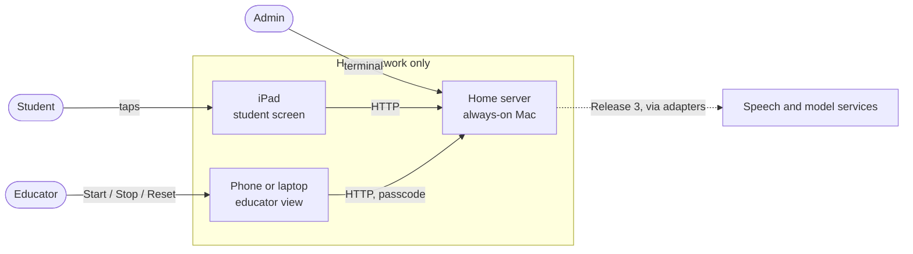
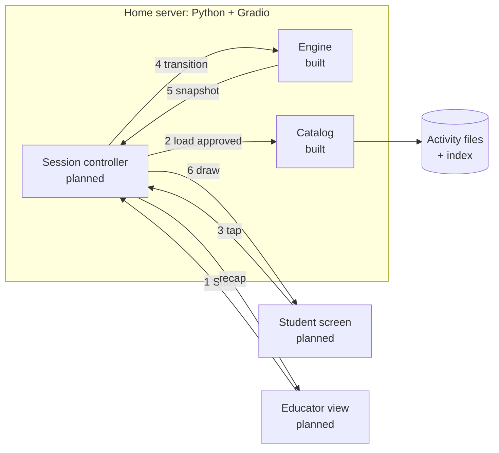
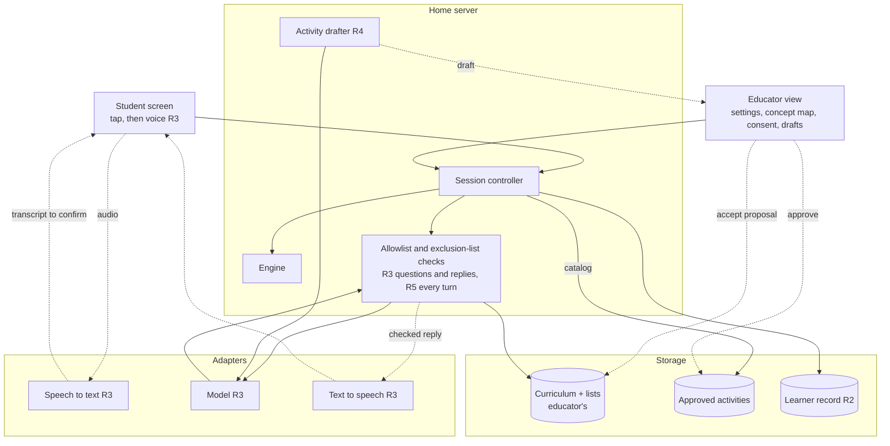

# Architecture

How Lerni works: what runs where, how an activity reaches the student, who owns which data, and which boundaries must hold. What to build is in the [PRDs](prd/); what's done is in [progress](progress.md). Parts that don't exist yet are marked *planned*.

## Bird's-eye view

The educator plans a learning path in a spreadsheet. One step of that path becomes an **activity**: a few teaching screens followed by one multiple-choice question, with hints and a picture. The activity file reaches the student only after the educator approves its exact content. The student app runs on a home server; the student uses it on an iPad, and the educator controls it from their own phone or laptop.

The admin tool (`lerni` in a terminal) is separate: the admin's own learning and testing tool, with its own data. Code and filenames say "lesson"; the docs say "activity". They mean the same thing.

## Context

Releases 1–2 use plain HTTP on the home network; there is no microphone, so HTTPS isn't required yet, and the app is never exposed to the internet. Release 3 adds HTTPS on the same server, because browsers allow the microphone only over HTTPS or on the device's own localhost ([MDN](https://developer.mozilla.org/en-US/docs/Web/API/MediaDevices/getUserMedia)). Hosting outside the home waits until it's needed.

## How an activity runs

1. The educator picks an approved activity and presses Start.
2. The **catalog** loads it only if it is approved and unaltered (below).
3. The student taps a choice. The tap carries the session and the screen it was drawn from, so the controller can ignore late or repeated taps. Contract: [MVP plan](../plans/release-1-mvp.md#to-build).
4. The **engine** takes the activity, the current state, and the event, and returns the next state. It is a pure function: the same inputs give the same result, and no model chooses content or moves the activity forward. Steps: [transition rules](../plans/specs/02-lesson-core.md#transition-rules).
5. The engine's **snapshot** holds only what the screen may show: the text, the choices (an ID and a label each), the hint, and the picture. Which choice is correct, the sources, and the approval records never leave the server. The answer appears only in the completion text, once the activity ends.
6. The student screen redraws. The educator sees the recap when the activity ends or is stopped.

**How an activity gets approved:** path step in the spreadsheet → activity file written by hand → four recorded approvals (science, student wording, pictures and accessibility, OK to use) → catalog. Each approval records the hash of the activity's reviewable content, including its pictures. Review records themselves are left out of that hash, so adding an approval doesn't invalidate it, but any change to the content does. A clean checker report, or a spreadsheet row marked `reviewed`, is not an approval.

## Who owns each kind of data

| Data | What it is | Owner | Where |
|---|---|---|---|
| Curriculum | Reusable concepts, how they relate, possible next steps, and authored paths. Path sequence numbers set order; relationships never do. | Educator | Spreadsheet files (built) |
| Activities | Reviewed teaching content for one path step, with its approvals | Educator approves; admin packages | `src/lerni/student/lessons/` (built) |
| Session | The live state of one activity run, and its recap | The app | Memory only; discarded on Reset or server restart (planned) |
| Learner record | Which activity revision was tried, concepts met, recall results. Meeting a concept is not the same as understanding it. | Educator can view and delete | Server storage (Release 2) |
| Admin data | The admin's own questions, concepts, and reviews | Admin | SQLite at `~/.lerni/lerni.db` (built) |

## Boundaries that must hold

If a change would break one of these, stop and ask.

1. **Only approved, unaltered activities reach the student.** The catalog refuses anything else, and a raw index entry is never treated as approved.
2. **The answer key stays on the server.** The snapshot type has no field for it.
3. **The engine decides progression, never a model.**
4. **Session updates are atomic and ignore stale input.** Stop and Reset win over any tap in flight.
5. **Home network only.** No public share links, no port forwarding, analytics off. Nothing about the student is written to disk in Release 1.
6. **Outside services go behind an adapter**, with credentials as `env:VAR` references, and only to services the educator agreed to. Tests use fakes.
7. **The student core imports only itself and the standard library.** Gradio stays an optional install.

## Codemap

- `src/lerni/student/`: `domain.py` (data types), `catalog.py` (loads and checks activities), `engine.py` (steps and snapshots), `canonical.py` (stable bytes for hashing), `lessons/` (activity files, pictures, generated index).
- `src/lerni/cli.py`, `commands/`, `db.py`, `sm2.py`: the admin tool.
- `scripts/`: the index generator and the curation checker. `curation/`: templates, [schema](../curation/schemas/educator-paths-v1.json), examples.
- `tests/`: pytest, fakes only. `plans/`: build plans by release.

## Target architecture (not built)

Where the system is headed by Release 5: the seams early code must leave room for, not a design for each release. Each release's design goes in its [build plan](../plans/README.md) when it starts.

| Piece | Release | Seam to leave room for now |
|---|---|---|
| Learner record | 2 | The controller saves state through one interface. Each activity revision maps to the concepts it teaches, so reminders and recall have something stable to point at. |
| HTTPS | 3 | Nothing depends on a particular address, so adding HTTPS changes configuration only. |
| Voice | 3 | Audio goes to speech-to-text before any text exists to confirm, so that service must be one the educator approved. After the student confirms, the transcript becomes the same kind of event as a tap. Recordings are deleted after use. |
| Replies | 3 | Every generated reply passes the checks before it is shown or spoken, and a reply that arrives after Stop is dropped. |
| Drafts and proposals | 4 | A drafted activity goes through the same four approvals. Accepting a proposed concept into the curriculum is a separate educator decision. |
| Free conversation | 5 | Lists and settings are read on every turn and take effect at once. |

Open questions that affect this: how to add HTTPS at home, and which parts of the admin tool the student app reuses ([admin PRD](prd/admin.md#open-questions)); where speech-to-text runs ([student PRD](prd/student.md#open-questions)).
