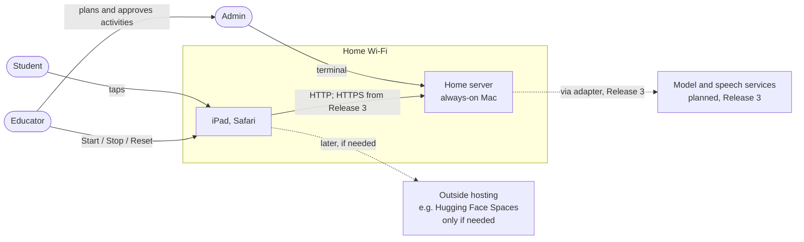
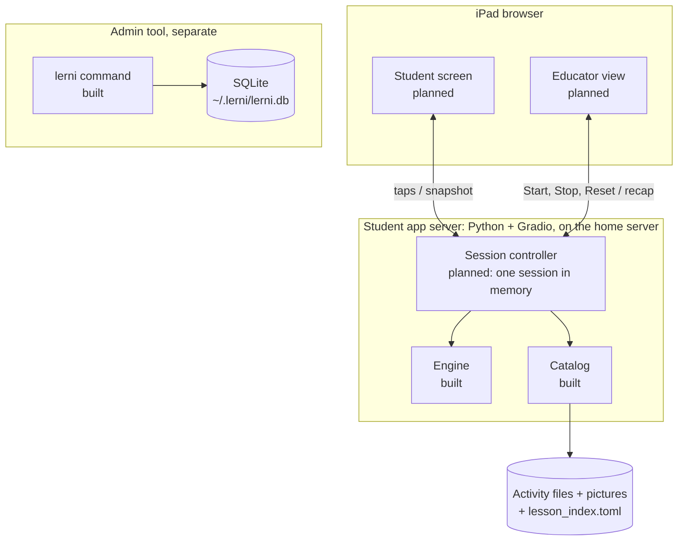
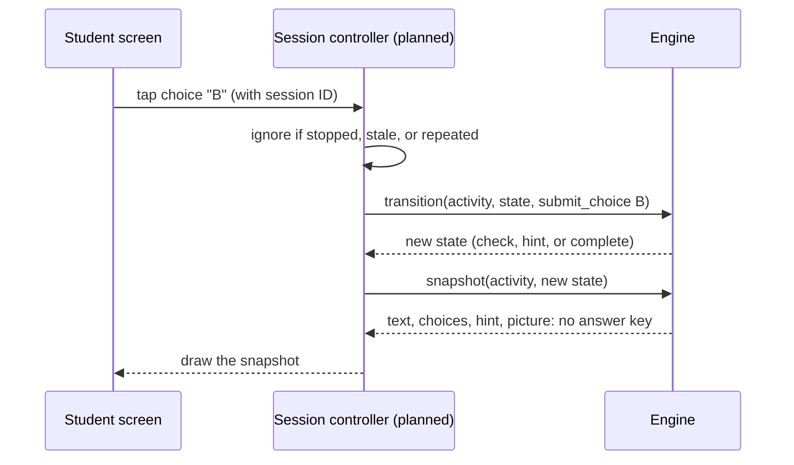
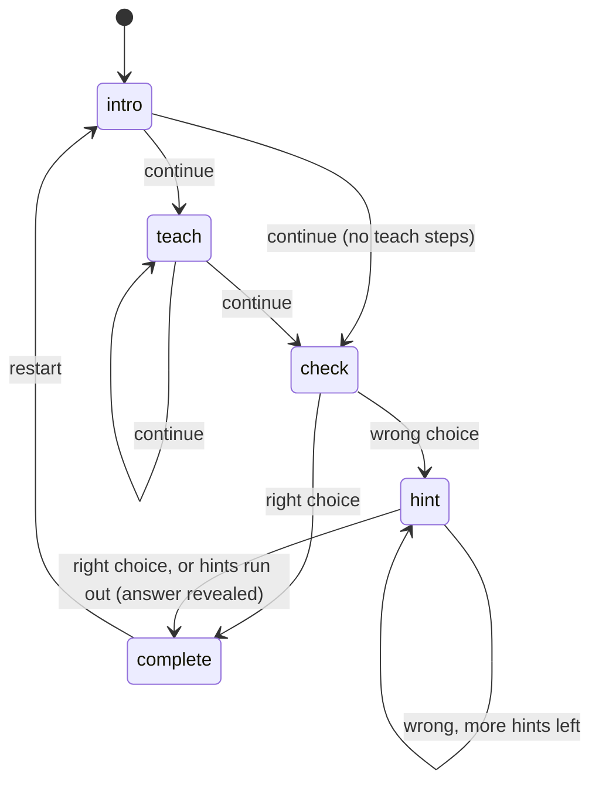
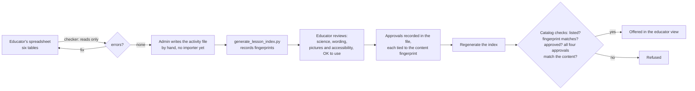
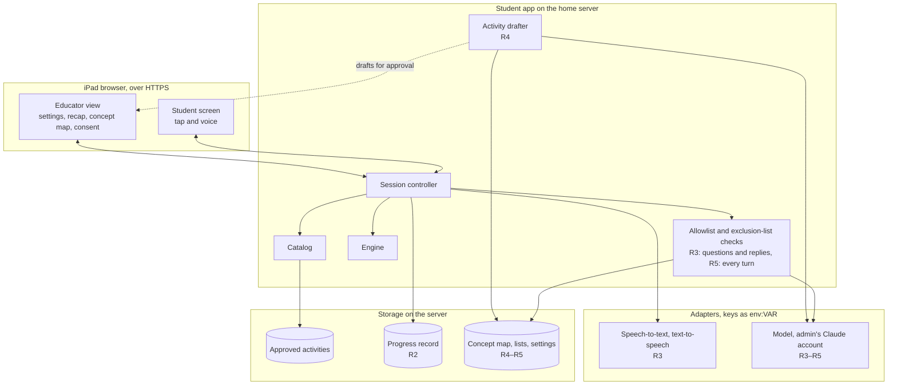

# Architecture

How Lerni works: what runs where, how an activity reaches the student, and where to find things in the code. What to build is in the [PRDs](prd/); what's done is in [progress](progress.md). Diagrams mark parts that don't exist yet as *planned*.

## Bird's-eye view

The educator plans a learning path in a spreadsheet. One step of that path becomes an **activity**: a short sequence of questions with choices, hints, and a picture. The activity is stored as a file, and it can reach the student only after the educator approves its exact content. The student app loads approved activities, runs them one step at a time, and shows them on an iPad. The educator starts and stops each session.

Separately, the admin tool (`lerni` in a terminal) is the admin's own learning and testing tool. It has its own data and shares no code with the student app yet.

Code and filenames say "lesson"; the docs say "activity". They mean the same thing.

## Context: who and what is involved

Everything runs on a home server, an always-on Mac, and the iPad connects over the home Wi-Fi. Releases 1–2 use plain HTTP. Release 3 adds HTTPS on the same server, because browsers allow the microphone only over HTTPS or on the device's own localhost ([MDN](https://developer.mozilla.org/en-US/docs/Web/API/MediaDevices/getUserMedia)). Hosting outside the home, such as Hugging Face Spaces, waits until the student needs the app away from home.

## Containers: what runs on the home server

The line between the browser and the server is the **trust boundary**. The answer key, sources, and approval records stay on the server. The browser receives only a *snapshot*: the text, choices, and picture for the current step. Gradio keeps each visitor's state on the server, separately, and a page reload starts a new session ([Gradio](https://www.gradio.app/guides/state-in-blocks)).

## How one tap works

The engine is a pure function: the same activity, state, and event always give the same result, and it keeps nothing between calls. An event is one of three actions: *continue*, *submit a choice*, or *restart*. A state that the engine could not have produced raises an error instead of guessing. No model chooses content or moves an activity forward.

The steps of one activity:

## How an activity reaches the student

A **fingerprint** is a hash of the exact content. Any edit changes it, so old approvals stop matching and the activity is refused until it is reviewed again. Regenerating the index never approves anything. Pictures are covered by the content fingerprint and checked again whenever they are read. A clean checker report, or a spreadsheet row marked `reviewed`, is not an approval.

## Codemap

| Where | What |
|---|---|
| `src/lerni/student/domain.py` | The data types: activity, step, state, event, snapshot, approvals, errors. Frozen dataclasses. |
| `src/lerni/student/catalog.py` | `PackageLessonCatalog`: reads and checks activity files and pictures; parses TOML strictly. |
| `src/lerni/student/engine.py` | `DeterministicLessonEngine`: `initial_state`, `transition`, `snapshot`. |
| `src/lerni/student/canonical.py` | Turns content into exact bytes, so fingerprints are stable. |
| `src/lerni/student/lessons/` | Activity files (`*.toml`), pictures (`assets/*.svg`), and the generated `lesson_index.toml`. One draft: car acceleration. |
| `src/lerni/cli.py`, `commands/` | The admin tool's commands: questions, reviews, concepts, reminders. |
| `src/lerni/db.py`, `sm2.py` | The admin tool's SQLite storage and SM-2 review scheduling. |
| `scripts/generate_lesson_index.py` | Rebuilds `lesson_index.toml` after any activity or picture change. |
| `scripts/validate_curation_templates.py` | The offline checker for the educator's spreadsheet files. |
| `curation/` | Spreadsheet templates, the [schema](../curation/schemas/educator-paths-v1.json), and examples (cars, sharks, soccer). |
| `tests/` | Pytest, fakes only, no network. `tests/student/` covers the student core. |
| `plans/` | Build plans by release; [release-1-mvp.md](../plans/release-1-mvp.md) is current. |

## Invariants

These must stay true. If a change would break one, stop and ask.

1. **Only approved, unaltered activities reach the student.** The catalog refuses anything else.
2. **The browser never gets the answer key.** The snapshot type has no field for it. The answer appears only in the completion text, after the activity ends.
3. **The engine decides progression, never a model.**
4. **Teaching order comes from path-step sequence numbers**, never from concept relationships.
5. **Outside services go behind an adapter**, with credentials as `env:VAR` references. Tests use fakes.
6. **Student data goes only to services the educator agreed to.** In Release 1, nothing about the student is written to disk, and logs hold no student content.
7. **The student core imports only itself and the standard library.** Gradio stays an optional install.

## Target architecture (not built)

Where the system is headed by Release 5. This shows the seams that early code must leave room for; it is not a design for each release. Each release's detailed design goes in its [build plan](../plans/README.md) when that release starts.

| Piece | Release | Seam to leave room for now |
|---|---|---|
| Progress record | 2 | The session controller reads and writes state through one interface, so moving from memory to storage changes one place. If hosting ever moves to Hugging Face Spaces, its default disk is wiped on restart, so the record would need attached storage ([HF](https://huggingface.co/docs/hub/spaces-storage)). |
| HTTPS on the home server | 3 | Nothing depends on a particular address or network, so adding HTTPS, or moving off the home server later, changes only configuration. The microphone needs HTTPS. |
| Speech adapter | 3 | The screen sends events, not raw input, so a spoken answer becomes the same event as a tap after the student confirms it. Recordings are deleted after use. |
| Question and reply checks | 3 | Every generated text passes the checks before the student sees or hears it. |
| Concept map and activity drafter | 4 | Drafts enter the same approval flow as hand-written activities; the catalog doesn't change. |
| Exclusion-list mode, concept-map view, consent | 5 | Settings and lists are read on every turn and take effect at once. |

Open questions that affect this: how to add HTTPS at home, and which parts of the admin tool the student app reuses ([admin PRD](prd/admin.md#open-questions)).
