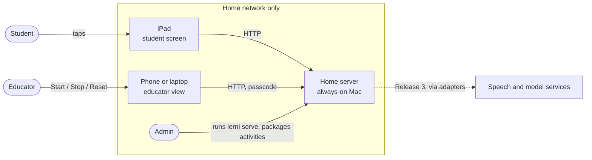
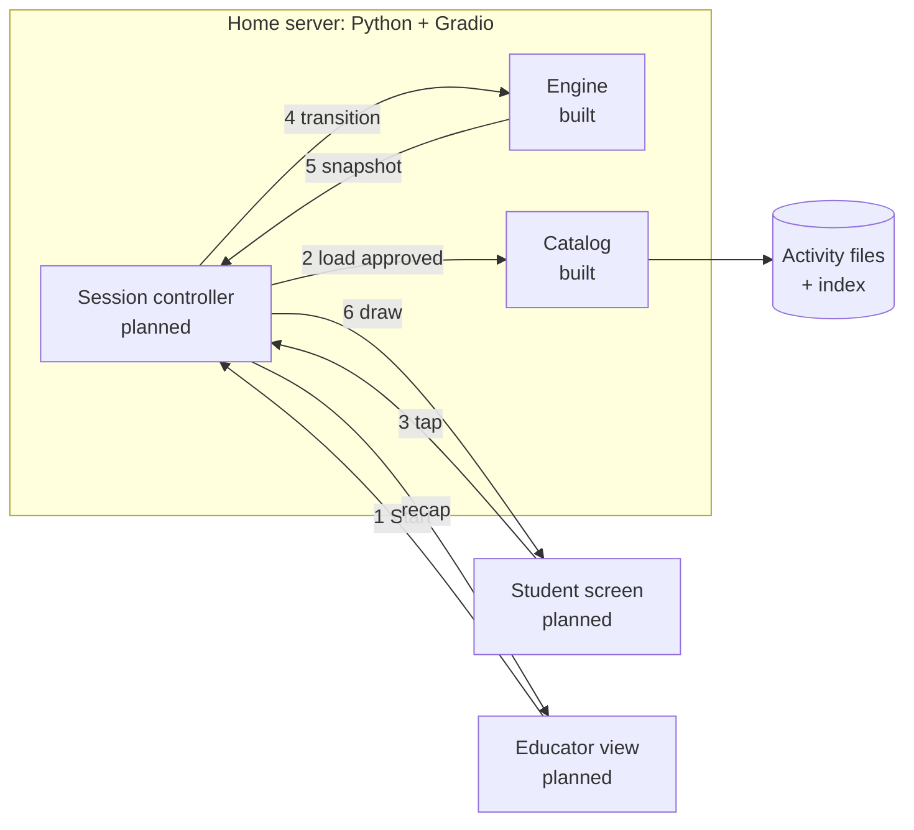
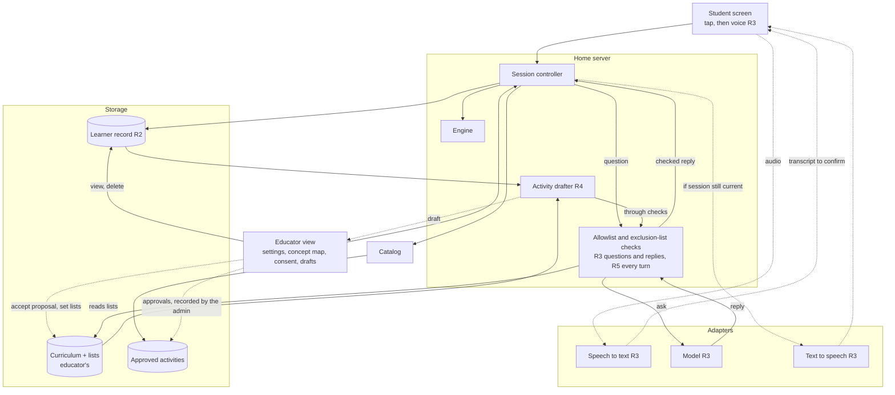

# Architecture

How Lerni works: what runs where, how an activity reaches the student, who owns which data, and which boundaries must hold. What to build is in the [PRDs](prd/); what's done is in [progress](progress.md). Parts that don't exist yet are marked *planned*.

## Bird's-eye view

The educator plans in the educator view: a learning plan with activities in teaching order, and an activity card for the next one. The admin turns a card into an **activity**: a few teaching screens followed by one multiple-choice question, with hints and a picture. The activity file reaches the student only after the educator approves its exact content. The student app runs on a home server; the student uses it on an iPad, and the educator controls it from their own phone or laptop.

It assumes one family, one student, and one live session at a time.

The admin tool (`lerni` in a terminal) is separate: the admin's own learning and testing tool, with its own data. Code and filenames say "lesson"; the docs say "activity". They mean the same thing.

## Context

Releases 1–2 use plain HTTP on the home network; there is no microphone, so HTTPS isn't required yet, and the app is never exposed to the internet. Release 3 adds HTTPS on the same server, because browsers allow the microphone only over HTTPS or on the device's own localhost ([MDN](https://developer.mozilla.org/en-US/docs/Web/API/MediaDevices/getUserMedia)). Hosting outside the home waits until it's needed.

## Trust boundaries

- **The home network is the outer boundary:** no port forwarding, never Gradio's public share links.
- **The student screen is open by design:** no login, so any device on the network can view and tap the live session. Accepted for one family.
- **The educator view is a separate app behind the passcode,** on its own route. Every educator action checks the passcode on the server; hiding a button is not protection. Until HTTPS (Release 3) the passcode travels unencrypted on the home network, which is accepted.
- **Session data stays in memory on the server** and is never saved in either browser.
- **Outbound:** none in Releases 1–2; from Release 3, only through adapters to services the educator agreed to.

## How an activity runs

1. The educator picks an approved activity and presses Start.
2. The **catalog** loads it only if it is approved and unaltered (below).
3. The student taps a choice. The tap carries the session and the screen it was drawn from, so the controller can ignore late or repeated taps. Contract: [MVP plan](../plans/release-1-mvp.md#to-build).
4. The **engine** takes the activity, the current state, and the event, and returns the next state. It is a pure function: the same inputs give the same result, and no model chooses content or moves the activity forward. Steps: [transition rules](../plans/specs/02-lesson-core.md#transition-rules).
5. The engine's **snapshot** holds nothing the student may not see: the text, the choices (an ID and a label each), the hint, the picture, and which buttons are active. Which choice is correct, the sources, and the approval records never leave the server. The answer appears only in the completion text, once the activity ends.
6. The student screen redraws on a short timer. The educator sees the recap when the activity ends or is stopped, until they dismiss it.

**Draft preview** runs in its own session on the educator's device, never the live one, with its pictures behind the passcode.

**How an activity gets approved:** the educator's activity card in the app → activity file, made by the admin (automated later) → four recorded approvals (science, student wording, pictures and accessibility, OK to use) → catalog. Each approval records the hash of the activity's reviewable content, which includes each picture's recorded hash; the picture bytes are checked against it when drawn. Review records themselves are left out of that hash, so adding an approval doesn't invalidate it, but any change to the content does. Hashes tie an approval to exact content but don't prove who gave it; that rests on [CLAUDE.md rule 5](../CLAUDE.md#rules): the admin records only real approvals, and no agent writes one. A saved activity card is not an approval.

## Who owns each kind of data

| Data | What it is | Owner | Where |
|---|---|---|---|
| Learning plans | An interest, a goal, and activities in teaching order, each with an optional activity card. The order of activities is the teaching order; how ideas relate never sets it. | Educator | JSON files in `~/.lerni/student/plans/` on the home server (built) |
| Activities | Reviewed teaching content for one path step, with its approvals | Educator approves; admin packages | `src/lerni/student/lessons/` (built) |
| Session | The live state of one activity run, and its recap | The app | Memory only; discarded on Reset or server restart (planned) |
| Learner record | Activities finished (by activity ID, version, and content hash), concepts met, recall results. Meeting a concept is not the same as understanding it. Kept until the educator deletes it. | Educator | Server storage (Release 2) |
| Lists, settings, consent | Allowlist and exclusion list; exploration mode, voice, and remembering; which outside services may receive data; sensitive-subject consents | Educator | Server storage (settings from Release 2) |
| Admin data | The admin's own questions, concepts, and reviews | Admin | SQLite at `~/.lerni/lerni.db` (built) |

## Boundaries that must hold

If a change would break one of these, stop and ask.

1. **Only approved, unaltered activities reach the student.** The catalog refuses anything else, and a raw index entry is never treated as approved. A draft can run only as a preview in the educator view, which needs the passcode.
2. **The answer key stays on the server.** The snapshot type has no field for it.
3. **The engine decides progression, never a model.**
4. **Session updates are atomic and ignore stale input.** The controller, not the engine, numbers sessions and screens, and a tap applies only if it matches the current ones. Once Stop commits, the server accepts no more input.
5. **Home network only, no outbound calls in Releases 1–2.** See [trust boundaries](#trust-boundaries). Nothing about the student is written to disk or browser storage in Release 1.
6. **Outside services go behind an adapter**, with credentials as `env:VAR` references, and only to services the educator agreed to. Tests use fakes.
7. **The core never imports Gradio.** The core (`domain`, `catalog`, `engine`, `canonical`, and the planned controller) uses only the standard library. The screens (planned, `src/lerni/student/web/`) may import Gradio, an optional install. The student package never opens the admin tool's database.

## Codemap

- `src/lerni/student/`: the core: `domain.py` (data types), `catalog.py` (the only place approvals are checked), `engine.py` (steps and snapshots), `canonical.py` (stable bytes for hashing), `lessons/` (activity files, pictures, generated index). Planned: `controller.py` and `web/` (the Gradio screens).
- `src/lerni/cli.py`, `commands/`, `db.py`, `sm2.py`: the admin tool.
- `src/lerni/student/plans.py` (learning plans and their store), `seed/` (the example plans), `web/` (the Gradio screens, including the educator's `guide.md`).
- `scripts/`: the lesson index generator.
- `tests/`: pytest, fakes only. `plans/`: build plans by release.

## Target architecture (not built)

Where the system is headed by Release 5: the seams early code must leave room for, not a design for each release. Arrows point from caller to what it calls; dotted lines are later or asynchronous. Each release's design goes in its [build plan](../plans/README.md) when it starts.

| Piece | Release | Seam to leave room for now |
|---|---|---|
| Learner record and settings | 2 | The controller saves state through one interface. Each activity revision maps to the concepts it teaches, so reminders and recall have something stable to point at. Settings are stored and take effect at once. |
| HTTPS | 3 | Nothing depends on a particular address, so adding HTTPS changes configuration only. |
| Voice | 3 | Audio goes to speech-to-text before any text exists to confirm, so that service must be one the educator approved. After the student confirms, the transcript becomes the same kind of event as a tap. Recordings are deleted after use. |
| Replies | 3 | Complete replies (never streamed) pass the checks before being shown or spoken; an outside check can only tighten. Anything arriving after Stop or Reset is dropped. |
| Drafts and proposals | 4 | Drafts pass the same checks and four approvals; accepting a proposed concept is a separate decision. The controller uses only the catalog interface, so activities can move to a data folder. |
| Free conversation | 5 | Lists are read on every turn. It replaces the present educator with prototype guardrails, so it needs a safety review first. |

Open questions that affect this: how to add HTTPS at home, and which parts of the admin tool the student app reuses ([admin PRD](prd/admin.md#open-questions)); where speech-to-text runs ([student PRD](prd/student.md#open-questions)).
