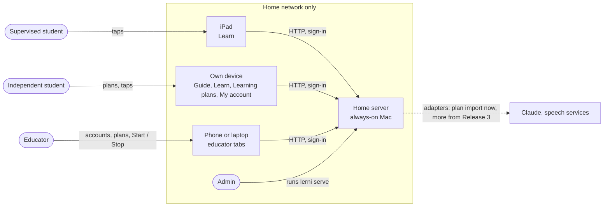
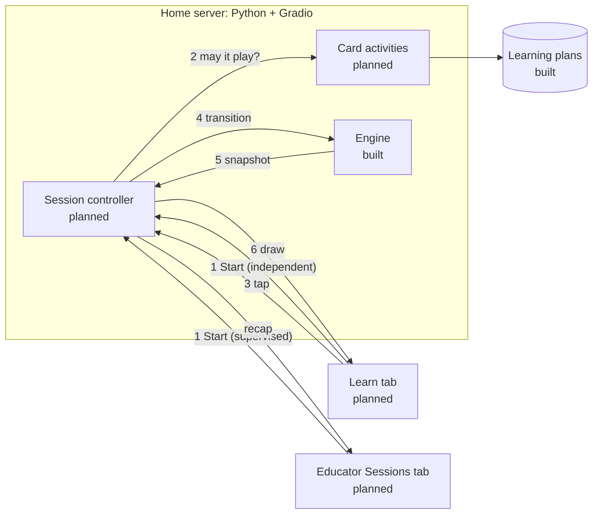
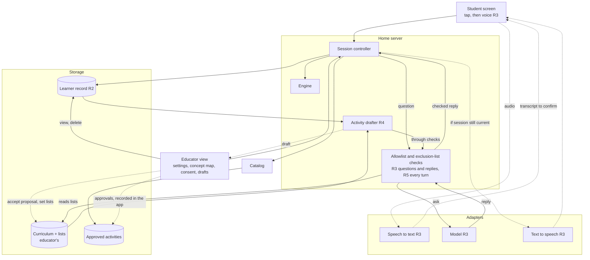

# Architecture

How Lerni works: what runs where, how an activity reaches the student, who owns which data, and which boundaries must hold. What to build is in the [PRDs](prd/); what's done is in [progress](progress.md). Parts that don't exist yet are marked *planned*.

## Bird's-eye view

**Today (built, steps 1–5):** everyone signs in at `/signin` to one app at `/app/`. The educator gets Guide, Students, Sessions, and Learning plans (plans, activity cards, and the Claude import); a supervised student gets Learn (a waiting screen); an independent student gets Guide, Learn, and My account.

**Planned (steps 7–9, [design](../plans/specs/03-student-accounts.md)):** the tabs depend on who signed in:

- The **educator** manages student accounts and plans the **library** for supervised students: learning plans with activities in teaching order, and an activity card for each. A complete, approved card becomes an **activity**: an intro and teaching screens, then one multiple-choice question with hints. The educator runs a supervised student's sessions from their own phone or laptop.
- A **supervised student** sees only Learn: the library cards the educator approved, started by the educator.
- An **independent student** gets the educator's planning tools scoped to their own plans, plus Learn and My account. They approve their own cards, or turn on Explore freely to let their own unapproved cards play, labeled, and start their own sessions.

It assumes one household, a few students, and one live session per student account. Students use an iPad or any browser on the home network.

The admin tool (`lerni` in a terminal) is separate: the admin's own learning and testing tool, with its own data. Code and filenames say "lesson"; the docs say "activity". They mean the same thing.

## Context

Releases 1–2 use plain HTTP on the home network; there is no microphone, so HTTPS isn't required yet, and the app is never exposed to the internet. Release 3 adds HTTPS on the same server, because browsers allow the microphone only over HTTPS or on the device's own localhost ([MDN](https://developer.mozilla.org/en-US/docs/Web/API/MediaDevices/getUserMedia)). Hosting outside the home waits until it's needed.

## Trust boundaries

- **The home network is the outer boundary:** no port forwarding, never Gradio's public share links.
- **Everyone signs in** on our own sign-in page, and Gradio's `auth_dependency` re-checks the account on every request, so an archive or password reset signs out every device at once.
- **Every handler resolves the signed-in account on the server** and checks every id the page sends against it. Hiding a tab, a component, or an event (`api_visibility="private"`) is not protection. Nothing per-user is built into the page layout, because Gradio sends every signed-in browser the same config. Until HTTPS (Release 3) passwords travel unencrypted on the home network, which is accepted; passwords keep students apart, they don't make the app safe to expose.
- **Who can do what** (accounts built; independent students' planning comes in step 7; details in the [design](../plans/specs/03-student-accounts.md#who-can-do-what)):

  | Who | Can |
  |---|---|
  | Admin | Everything an educator can, plus run the server, read every file on it, and add or recover accounts from the terminal |
  | Educator (an independent account with educator access) | Everything an independent student can, plus manage every account, plan and approve the library, run supervised students' sessions |
  | Independent student | Plan, approve, and play their own plans; change their own account |
  | Supervised student | Play the library's approved cards when the educator starts them |

  No educator screen shows an independent student's plans or sessions. That is privacy by default, not a protection: the educator can reset a password and sign in as that student, and the admin can read every file.
- **Devices are a household rule:** a supervised student's iPad is signed in only as that student, and never saves anyone else's password. The admin and educator dogfood on their own devices.
- **Session data stays in memory on the server.** The browser keeps only the sign-in cookie.
- **Files:** Gradio serves cached files to anyone signed in who knows the URL. Accepted in Release 1: pictures are curriculum, cards have none, and uploads are deleted right after reading.
- **Outbound:** the activity screens never call out. In Release 1 the outbound calls are to Claude (Anthropic) through the admin's Claude account: the plan import, made by the educator or an independent student after ticking the consent box, and Ask Lerni, an independent student's text conversation. Neither adds account details, and Claude Code keeps no transcript on the server (Anthropic's retention still applies); from Release 3, more calls, always through adapters to services the educator (for supervised students) or the independent student (for themselves) agreed to.

## How an activity runs

1. The educator presses Start for a supervised student, or an independent student taps an activity in Learn.
2. **Card activities** build a playable activity only if the card is complete and may play for this viewer (below); the check runs again at Start.
3. The student taps a choice. The tap carries the session and the screen it was drawn from, so the controller can ignore late or repeated taps. Contract: [MVP plan](../plans/release-1-mvp.md#to-build).
4. The **engine** takes the activity, the current state, and the event, and returns the next state. It is a pure function: the same inputs give the same result, and no model chooses content or moves the activity forward. Steps: [transition rules](../plans/specs/02-lesson-core.md#transition-rules).
5. The engine's **snapshot** holds nothing the student may not see in Learn: the text, the choices (an ID and a label each), the hint, the picture, and which buttons are active. Which choice is correct, the sources, and the approval records never reach the Learn screen. The answer appears only in the completion text, once the activity ends. (An independent student sees their own answers in Learning plans, where they wrote them.)
6. The student's screen redraws on a short timer. The recap shows when the activity ends or is stopped, until the educator (supervised) or the student (independent) dismisses it.

There is one live session per student account (planned), so two students never affect each other, and any device signed in as that student drives it.

**When an activity may play:** the controller accepts only a playable activity built by card activities, which records where it came from:

| Provenance | Viewer | Plan | Needs |
|---|---|---|---|
| Educator-approved | A supervised student | The library | The educator's four checks (science, student wording, pictures and accessibility, OK to use) for its exact content |
| Self-approved | An independent student | Their own | Their own "This is ready" for its exact content |
| Unchecked | An independent student | Their own | Their own Explore freely on; labeled "Not checked" |

Each approval records the SHA-256 of everything Learn shows for that activity, so any edit un-approves it. Hashes tie an approval to exact content but don't prove who gave it; that rests on [CLAUDE.md rule 5](../CLAUDE.md#rules): only a signed-in person's tap records an approval, the server sets who and when, and no agent writes one. A saved activity card is not an approval.

**Packaged activities** (the car activity, built) are curated files with sources and pictures, checked by the catalog: each of four recorded approvals carries the hash of the activity's reviewable content, including each picture's hash, and the picture bytes are checked when drawn. Release 1 doesn't play them; the catalog stays for curated content later. Draft preview of a packaged activity runs only in the educator's tabs.

## Who owns each kind of data

| Data | What it is | Owner | Where |
|---|---|---|---|
| Student accounts | Username, display name (a nickname is fine), kind, password hash, session version, Explore freely date (set only by that student), archived flag | Educator manages; an independent student changes their own name, password, and Explore freely | JSON files in `~/.lerni/student/students/` (built) |
| Learning plans | An interest, a goal, and activities in teaching order, each with an optional activity card and its approval. The order of activities is the teaching order; how ideas relate never sets it. | The library is the educator's; an independent student owns their own (`owner`, set by the server) | JSON files in `~/.lerni/student/plans/` on the home server (built; owner and approvals planned, step 7) |
| Packaged activities | Curated teaching content with sources and pictures, with its approvals | Educator approves; admin packages | `src/lerni/student/lessons/` (built) |
| Ask Lerni conversation | An independent student's questions and Claude's answers, the last 20 messages | That student | Memory only, one ongoing conversation per student; gone on New conversation or server restart (built) |
| Session | The live state of one activity run, and its recap; one per student account | The app | Memory only; discarded on Reset or server restart (planned) |
| Sign-in | The signing secret; wrong-password delays | The app | `~/.lerni/student/secret.key`; delays in memory (built) |
| Learner record | Activities finished (by activity ID, version, and content hash), concepts met, recall results. Meeting a concept is not the same as understanding it. | The educator for a supervised student; an independent student for their own | Server storage (Release 2) |
| Lists, settings, consent | Allowlist and exclusion list; exploration mode, voice, and remembering; which outside services may receive data; sensitive-subject consents | The educator for supervised students; an independent student sets their own settings and consent, and has no lists | Server storage (settings from Release 2) |
| Admin data | The admin's own questions, concepts, and reviews | Admin | SQLite at `~/.lerni/lerni.db` (built) |

## Boundaries that must hold

If a change would break one of these, stop and ask.

1. **An activity plays only with the right approval for that viewer:** the educator's four checks for a supervised student, the independent student's own "This is ready" for their own plan, or that student's own Explore freely (labeled unchecked). Incomplete cards never play. A raw index entry is never treated as approved, and a draft preview never becomes a playable activity.
2. **The answer key stays on the server** during play. The snapshot type has no field for it.
3. **The engine decides progression, never a model.**
4. **Session updates are atomic and ignore stale input.** The controller, not the engine, numbers sessions and screens, and a tap applies only if it matches the current ones. Once Stop commits, the server accepts no more input.
5. **Home network only; the activity screens never call out.** See [trust boundaries](#trust-boundaries). The only things saved about a student are their account and an independent student's own plans; session state and progress never go to disk or browser storage in Release 1.
6. **Every request resolves the signed-in account on the server** by re-reading its record: a missing or archived account, or an old session version, gets nothing, and the kind comes from the record. Every id from the page is checked against that account. A student never reaches another student's plans or sessions, or an educator action.
7. **Outside services go behind an adapter**, with credentials as `env:VAR` references, and only to services agreed to: by the educator for supervised students and the library, by an independent student for their own. Tests use fakes.
8. **The core never imports Gradio.** The core (`domain`, `catalog`, `engine`, `canonical`, `plans`, `plan_import`, `conversation`, `students`, `signin`, `jsonfiles`, and the planned `card_activity` and `controller`) uses only the standard library. Provider SDKs live only in `adapters/`. The screens (`src/lerni/student/web/`) may import Gradio, an optional install. The student package never opens the admin tool's database.

## Codemap

Every code file, one line each: [code manifest](code-manifest.md).

- `src/lerni/student/`: the core: `domain.py` (data types), `catalog.py` (checks packaged activities' approvals), `engine.py` (steps and snapshots), `canonical.py` (stable bytes for hashing), `lessons/` (activity files, pictures, generated index). `students.py` (accounts and passwords), `signin.py` (passwords, the signed cookie, who's signed in), `jsonfiles.py` (atomic JSON writes). Planned: `card_activity.py` (checks cards and builds playable activities), and `controller.py` (one session per student account).
- `src/lerni/cli.py`, `commands/`, `db.py`, `sm2.py`: the admin tool.
- `src/lerni/student/plans.py` (learning plans and their store), `plan_import.py` (rough notes to a proposed plan), `conversation.py` (Ask Lerni's in-memory conversations), `adapters/claude_code.py` (Claude through the Claude Code CLI, for the import and Ask Lerni; prototype), `seed/` (the example plans), `web/` (the Gradio screens: `signin_page.py`, `main.py` with the tabs by role, `ask.py`, `educator.py`, `accounts.py`, and the educator's `guide.md`).
- `scripts/`: the lesson index generator.
- `tests/`: pytest, fakes only. `plans/`: build plans by release.

## Target architecture (not built)

Where the system is headed by Release 5: the seams early code must leave room for, not a design for each release. Arrows point from caller to what it calls; dotted lines are later or asynchronous. Each release's design goes in its [build plan](../plans/README.md) when it starts.

| Piece | Release | Seam to leave room for now |
|---|---|---|
| Learner record and settings | 2 | The controller saves state through one interface. Each activity revision maps to the concepts it teaches, so reminders and recall have something stable to point at. Settings are stored and take effect at once. |
| HTTPS | 3 | Nothing depends on a particular address, so adding HTTPS changes configuration only. |
| Voice | 3 | Audio goes to speech-to-text before any text exists to confirm, so that service must be one the educator approved. After the student confirms, the transcript becomes the same kind of event as a tap. Recordings are deleted after use. |
| Replies | 3 | A supervised student's replies are complete (never streamed) and pass the checks before being shown or spoken; an outside check can only tighten. Anything arriving after Stop or Reset is dropped. |
| Drafts and proposals | 4 | Drafts pass the same checks and four approvals; accepting a proposed concept is a separate decision. The controller uses only the catalog interface, so activities can move to a data folder. |
| Free conversation | 5 | Lists are read on every turn. It replaces the present educator with prototype guardrails, so it needs a safety review first. |

Open questions that affect this: how to add HTTPS at home, and which parts of the admin tool the student app reuses ([admin PRD](prd/admin.md#open-questions)); where speech-to-text runs ([student PRD](prd/student.md#open-questions)).
