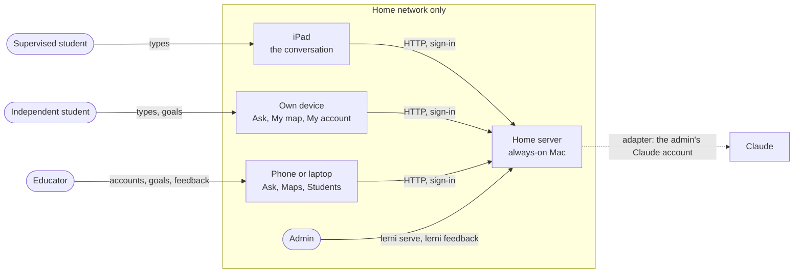
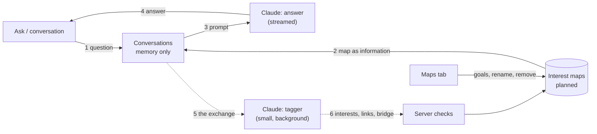

# Architecture

How Lerni works: what runs where, how a conversation grows a student's interest map, who owns which data, and which boundaries must hold. What to build is in the [PRDs](prd/); the design is the [interest map spec](../plans/specs/04-interest-map.md); what's done is in [progress](progress.md). Parts that don't exist yet are marked *planned*.

## Bird's-eye view

**Built (steps 1–6):** everyone signs in at `/signin` to one app at `/app/`. Independent students (educators included) have **Ask**, one ongoing text conversation with Claude. Educators also have Students, and the older Learning plans and Sessions tabs, which step 7 removes.

**Planned (steps 7–10):**

- **Every student** talks with Lerni. After each exchange, a small second call updates the student's **interest map**: interests (sized by time spent), links, and bridges.
- **Educators** add **goals** to a supervised student's map (by hand, or by uploading notes Claude turns into interests), watch the map on **Maps**, and leave **feedback** for the admin.
- **Independent students** see **My map** and set their own goals (things to practice).
- **Supervised students** see only the conversation, full screen, with an educator beside them.

It assumes one household, a few students, one map per student. Students use an iPad or any browser on the home network. The admin tool (`lerni` in a terminal) is separate: the admin's own learning tool with its own data, plus `lerni student` and (planned) `lerni feedback`.

## Context

Releases 1–2 use plain HTTP on the home network and are never exposed to the internet. Release 3 adds HTTPS on the same server, because browsers allow the microphone only over HTTPS ([MDN](https://developer.mozilla.org/en-US/docs/Web/API/MediaDevices/getUserMedia)).

## How a conversation grows the map

1. The student sends a question.
2. The prompt is the persona for their kind, then their map as information (top interests, goals with notes, recent bridges), then the safety rules, always last.
3. Claude answers, streamed. It follows their curiosity and, every few exchanges, bridges toward one goal.
4. The answer is shown; the conversation stays in memory only.
5. In the background, a small call gets that one exchange and the existing interest names (never the username).
6. It returns which interests the exchange was about, new interests, links, and whether a bridge happened. The server keeps only short plain names, never lets it touch goals, adds the time (capped at 3 minutes per exchange), and writes the map. A failure is ignored.

## Trust boundaries

- **The home network is the outer boundary:** no port forwarding, never Gradio's public share links.
- **Everyone signs in** on our own sign-in page, and Gradio's `auth_dependency` re-checks the account on every request, so an archive or password reset signs out every device at once.
- **Every handler resolves the signed-in account on the server** and checks every id the page sends against it. Hiding a tab, a component, or an event (`api_visibility="private"`) is not protection. Nothing per-user is built into the page layout, because Gradio sends every signed-in browser the same config. Passwords travel unencrypted on the home network until HTTPS (Release 3), which is accepted.
- **Who can do what:**

  | Who | Can |
  |---|---|
  | Admin | Everything an educator can, plus run the server, read every file on it, add or recover accounts, and read feedback in the terminal |
  | Educator (an independent account with educator access) | Everything an independent student can, plus manage every account, set goals on and watch supervised students' maps, and leave feedback |
  | Independent student | Talk with Lerni; see their own map and set its goals; change their own account |
  | Supervised student | Talk with Lerni, with an educator beside them |

  No educator screen shows an independent student's map. That is privacy by default, not a protection: the educator can reset a password and sign in as that student, and the admin can read every file.
- **Devices are a household rule:** a supervised student's iPad is signed in only as that student.
- **Outbound:** all calls go to Claude (Anthropic) through the admin's Claude account, behind an adapter: the answers, the tagger, the upload, and the feedback summary. No account details are added, and Claude Code keeps no transcript on the server (Anthropic's retention still applies). A supervised student's conversation through this consumer account is a known exception the admin accepted, on the condition that an educator is beside them ([spec](../plans/specs/04-interest-map.md#supervised-students)).
- **Files:** uploads are read and deleted at once; maps and feedback are written only by the server.

## Who owns each kind of data

| Data | What it is | Owner | Where |
|---|---|---|---|
| Student accounts | Username, display name, kind, password hash, session version, educator flag, archived flag | Educator manages; an independent student changes their own name and password | `~/.lerni/student/students/` (built) |
| Interest map | Entries (name, interest or goal, notes, seconds, mentions, dates) and links (related or bridge) | Educators for a supervised student; an independent student for their own | `~/.lerni/student/maps/<username>.json` (planned, step 7) |
| Conversation | The last 20 messages, one ongoing conversation per student | That student | Memory only; gone on New conversation or a server restart (built) |
| Feedback | Date, who, which map, the educator's text, the agent's summary | The admin processes it | `~/.lerni/student/feedback.jsonl` (planned, step 8) |
| Sign-in | The signing secret; wrong-password delays | The app | `~/.lerni/student/secret.key`; delays in memory (built) |
| Learning plans, packaged activities | The older activity path | — | `plans/`, `lessons/` (built; removed in step 10) |
| Admin data | The admin's own questions, concepts, and reviews | Admin | SQLite at `~/.lerni/lerni.db` (built) |

## Boundaries that must hold

If a change would break one of these, stop and ask.

1. **Only people set goals.** Goals and their notes come only from a signed-in educator (or an independent student for their own map), through the server. The tagger can add interests, time, and links, never goals. Feedback is summarized, never acted on.
2. **Conversation text is never saved:** not to disk, logs, or browser storage. Only the account, the map, and feedback are saved.
3. **The safety rules come last** in every prompt, after the persona and the map, and live in code, not in the editable persona files.
4. **Home network only.** See [trust boundaries](#trust-boundaries).
5. **Every request resolves the signed-in account on the server** by re-reading its record. A student never reaches another student's map or conversation, or an educator action.
6. **Outside services go behind an adapter**, with credentials as `env:VAR` references. Tests use fakes.
7. **The core never imports Gradio.** The core (`students`, `signin`, `jsonfiles`, `conversation`, and the planned `interests`) uses only the standard library. Provider SDKs live only in `adapters/`; screens (`web/`) may import Gradio, an optional install. The student package never opens the admin tool's database.

## Codemap

Every code file, one line each: [code manifest](code-manifest.md).

- `src/lerni/student/`: `students.py` (accounts and passwords), `signin.py` (the signed cookie, who's signed in), `jsonfiles.py` (atomic JSON writes), `conversation.py` (the prompt, in-memory conversations), `personas/` (one starting persona per kind of student), `adapters/claude_code.py` (Claude through the Claude Code CLI; prototype). Planned: `interests.py` (the map and its store). Removed in step 10: `domain.py`, `catalog.py`, `engine.py`, `canonical.py`, `lessons/`, `plans.py`, `plan_import.py`, `seed/`.
- `src/lerni/student/web/`: the Gradio screens: `signin_page.py`, `main.py` (tabs by role), `ask.py`, `accounts.py`, and today's `educator.py` (replaced by Maps in step 7).
- `src/lerni/cli.py`, `commands/`, `db.py`, `sm2.py`: the admin tool.
- `tests/`: pytest, fakes only. `plans/`: build plans and specs.

## Later releases

| Piece | Release | Seam to leave room for now |
|---|---|---|
| Remembering preferences, recall | 2 | The map is the memory; preferences and recall build on it. |
| Voice and HTTPS | 3 | Nothing depends on a particular address. Audio goes to a speech-to-text service the educator approved; the confirmed text enters the conversation like typing. Recordings are deleted after use. |
| Suggested goals | 4 | Suggestions are shown for the educator to accept; they never become goals on their own (boundary 1). |
| Without an educator present | 5 | Needs a safety review first: checked replies for supervised students and consent for sensitive subjects. |
