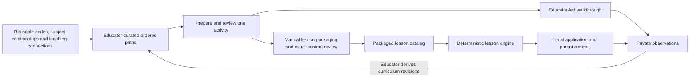

# Lerni — Product Requirements

Adopted 2026-09-25 from the revised product direction. Current-state statements were checked against the local checkout at `54acca4` (branch `explore/curation-templates`) plus the working change that adds educator authoring; see [progress.md](./progress.md) for dated evidence. Requirements below describe work to deliver, not capabilities already available. This document approves no curriculum and authorizes no student session.

## 1. Purpose

Lerni helps a learner use an existing interest to reach a useful underlying idea, demonstrate understanding, and revisit that idea later. The immediate goal is to establish a small learning loop: an educator prepares a relevant activity, a student tries it with an adult, and those observations improve both the curriculum and the product.

Educator curation and product development proceed in parallel. The educator can outline reusable learning paths before the application exists. Student involvement starts with a short reviewed educator-led walkthrough; the first application session uses the revised material after the app passes its own checks.

The first milestone does not require a complete knowledge graph, an AI tutor, or automated recommendations. It requires independent educator authoring, useful learning observations, and a small working application loop informed by those observations.

## 2. Product modes and participants

| Mode | Purpose | Current position |
|---|---|---|
| Study | Adult self-directed study through Feynman explanations and SM-2 review scheduling | Existing CLI; maintenance and hardening only. New Study features remain parked. |
| Explore | Interest-led learning with educator-authored material and a supervising adult | Active product focus. The lesson core exists; a usable application remains to be built. |

The modes share a repository and Python tooling. They do not currently share an application runtime, curriculum store, learner database, or scheduler. Study's graph is not the Explore curriculum, and its SM-2 scheduling is not an Explore prerequisite. Preserve Study compatibility throughout Explore work.

| Participant | Responsibility |
|---|---|
| Educator | Define concepts and learning goals; curate paths; prepare the next activity; review educational content; interpret observations and revise. |
| Parent or supervising adult | Help choose an appropriate starting interest; review fit and materials; authorize the enabled experience; remain present and stop the session when needed. |
| Student | Choose whether to participate, explore an activity, show or explain understanding, and stop whenever they wish. |
| Developer | Deliver authoring checks, content handoff, application behavior, and technical verification without inventing curriculum approvals or learner outcomes. |

The initial Explore context remains one family, approximately ages 7–9. Reusable graph definitions should avoid embedding a particular learner or permanently fixing a concept to one age or subject. Educator participation does not imply that classroom deployment or multi-user accounts are in scope.

## 3. Product goals and evidence

| Goal | Evidence to seek |
|---|---|
| Educators can author independently | An educator sketches three to five activities, reuses or adds concepts, and prepares the next activity without requiring a developer to edit application code. |
| Interests lead to meaningful ideas | The educator can explain each transition and identify what the activity is intended to help the learner understand. |
| Early testing informs development | A reviewed manual walkthrough identifies something to preserve and one change to try before the app session. |
| The app makes the activity usable | An adult can start, interrupt, reset, and complete the installed activity; later student observations distinguish an interface problem from a content problem. |
| The schema supports reuse | A second interest uses at least one shared concept without special-case schema or engine changes. |
| Learning evidence is more than task completion | A check or explanation probes the intended idea; a brief later recall question provides another observation when appropriate. |

A correct authored choice alone does not establish mastery. Session length, graph size, or the number of generated nodes are not success measures. Willingness to return is useful evidence, not a requirement placed on the student. One disappointing session should prompt examination of fit, content, and interface before a decision to continue, revise, or pause.

## 4. High-level architecture

Explore separates curriculum authoring, content review and packaging, deterministic lesson execution, and private learner observations.



The diagram describes the target workflow. It is not a claim that every connection or component has been implemented.

| Layer | Responsibility | Current implementation |
|---|---|---|
| Authoring | Reusable concepts, relationships, teaching connections, paths, activities, and sources | `educator-paths-v1` templates, six draft example paths, and an offline drafting checker exist under [`curation/`](../curation/README.md). They are not connected to the app and there is no importer. |
| Review and packaging | Select an activity, review its exact wording and assets, and represent it in the lesson format | Lesson format and review metadata exist. The educator-to-lesson handoff is initially manual; an automated converter does not exist. |
| Catalog | Load packaged lesson resources and enforce the applicable schema, integrity, and approval rules | Implemented. Existing Chain-1 content is a draft and is excluded from the approved catalog. |
| Engine | Advance introduction, teaching, check, hint, and completion from explicit application events | Implemented; integration and focused hardening remain necessary. |
| Application | Present authored content and choices; own session lifetime and parent controls | Planned local browser application, using the existing Gradio direction. Not implemented. |
| Learner observations | Keep session observations separate from reusable curriculum | A private manual log (fields in section 9) is kept outside the repository. Application persistence is deferred from the first slice. |
| Recommendations | Explain useful reviewed next options; propose graph additions for educator review | Planned. No active recommendation or graph-growth system exists. |

The graph represents reusable educational structure. Semantic relationships do not set lesson order. Paths select and order teaching transitions. The application owns execution of a chosen, approved lesson; a model cannot advance state, grade a response, or silently change the curriculum.

## 5. Educator authoring requirements

The authoring contract is `educator-paths-v1`. Its six tables are:

| Table | One row represents | Key distinction |
|---|---|---|
| Nodes | One reusable topic or concept | A concept can be reused across subjects, learners, and paths. |
| Relationships | One subject relationship | Describes how concepts relate, not what to teach next. |
| Connections | One directional teaching transition | Explains why moving from one concept to another may help. |
| Paths | One educator-curated route with an entry concept and learning goal | Two alternative routes can start from the same interest. |
| Path Steps | One ordered activity occurrence targeting a concept | Sequence determines order; a concept may be revisited later. |
| Sources | One reusable reference | Citation supports review; it is not itself approval. |

Required behavior:

- Stable text IDs survive sorting, insertion, reordering, and label changes. IDs do not come from spreadsheet row numbers.
- Nodes have a label and definition. “Interest,” “bridge,” and “fundamental” are contextual roles, not permanent node types.
- Subject relationships initially use `is_a`, `part_of`, `example_of`, `uses`, `explains`, and `related_to`, with documented direction. `related_to` is symmetric.
- Teaching connections are directional and have a specific learning reason. A reverse move needs its own rationale.
- Each path step has a stable ID, path ID, positive sequence, target node, connection, and goal. Its connection starts at the entry node or preceding target and ends at the current target.
- Multiple paths can share nodes and connections. A later activity in one path can revisit a concept with a different goal and occurrence ID. Do not impose a global acyclic-graph rule.
- The educator can outline a complete path while leaving later lesson details unfinished. Incomplete draft activity fields remain visibly incomplete; they do not force unnecessary scripting or become publishable lessons.
- Before testing a selected step, complete its opening prompt, activity, understanding check, expected observation, necessary materials, and content revision. “None” is a valid materials decision; blank means undecided.
- Status on the five curriculum tables is `draft`, `reviewed`, `needs_revision`, or `retired`; Sources is a separate reference table. A real review has a reviewer role and date. Delivered examples remain draft with blank review fields.
- References and tags use the documented `|` separator. Dates are actual date values in the workbook and ISO dates in CSV export.
- Structural checks detect duplicate IDs, broken references, invalid values, duplicate path positions, gaps, and inconsistent transitions. Checks explain issues in educator-readable terms and preserve valid drafts.

The examples must test generality: six paths spanning cars, music, cooking, plants, and building; two routes from one interest; at least 24 nodes, 30 subject relationships, 18 teaching connections, and 24 path steps. Include cross-subject reuse, several incoming connections, and a legitimate revisit. These examples are not approved curriculum.

Exact column definitions and export rules are maintained in [`plans/specs/08c-educator-path-authoring.md`](../plans/specs/08c-educator-path-authoring.md); the educator how-to is the [template README](../curation/templates/educator-paths-v1/README.md). The repository's older `curation/templates/v1/` tables use a different delivery-oriented contract; direct import compatibility is not promised.

## 6. First educator-led walkthrough

1. Choose an interest that actually fits the student and one concrete learning goal. Cars are an optional example.
2. Sketch three to five activities using reusable nodes and explicit teaching connections.
3. Prepare only the first activity in sufficient detail to conduct it.
4. Have the educator and parent review the exact activity for accuracy, wording, accessibility, materials, and fit. Resolve relevant content questions before showing it to the student. Preserve existing exact-content approval requirements when using packaged application material.
5. Conduct approximately five to ten minutes with an adult present. The student may stop earlier.
6. Record brief private observations afterward: what attracted interest, what was confusing, and one revision to try. Separate observations from interpretations.

This walkthrough does not require the application, a working importer, or a complete graph. It does require prepared and genuinely reviewed material. It does not qualify the application for student use.

## 7. First authored application slice

### Required experience

An adult opens the local app, chooses the reviewed activity, and starts it. The student sees authored lesson text and necessary curated visuals, responds using authored choices, receives the authored hints or explanation, and reaches completion. Parent Stop and Reset remain available. Record early product and learning observations manually outside the application.

One workbook path step maps initially to one short lesson containing its own understanding check. The workbook does not mirror the engine's internal presentation steps. A separate mapping record retains `path_id`, `path_step_id`, and the relevant activity and lesson revisions.

### Functional requirements

| ID | Requirement | Acceptance evidence |
|---|---|---|
| APP-01 | Use the existing lesson domain, catalog, and deterministic engine. | The installed app loads a genuinely reviewed lesson and its intended packaged resources. |
| APP-02 | Present visible authored text, required visuals and text alternatives, choices, hints, and completion. | An adult completes the intended flow using the installed application. |
| APP-03 | Provide parent Start, Stop, and Reset. | Stop ends the active interaction and invalidates pending work; Reset clears current in-memory progress and returns to the parent start state. A new activity requires an explicit Start. |
| APP-04 | Enforce session ownership for callbacks and events. | Late, duplicate, or previous-session callbacks cannot advance a stopped, reset, or replacement session. |
| APP-05 | Exclude unapproved or corrupted packaged content. | Approval and resource-integrity checks reject relevant invalid inputs and assets. |
| APP-06 | Operate on localhost with bundled resources and no application-initiated outbound requests. | Configuration and runtime observation verify the enabled slice, including disabled sharing, analytics, and remote assets. |
| APP-07 | Keep the first slice free of persistent student telemetry. | Synthetic checks show no unintended application-managed storage of responses, progress, or observations; logs contain no learner content. |
| APP-08 | Preserve Study compatibility. | Appropriate regression checks pass or clearly documented baseline failures are distinguished from new failures. |

### Explicitly outside this slice

AI tutoring, microphone access, speech output, free-form generated responses, accounts, cloud synchronization, automated graph traversal, persistent student telemetry, and automatic curriculum import are deferred. Local HTTP between the browser and application is expected; “local-only” means no outbound service dependency for this slice.

This reduced scope must be reconciled with the repository's existing runtime and pilot specifications before implementation. Do not disable existing protections or declare a gate passed merely because optional features are removed. Establish acceptance checks for the actual enabled slice, run synthetic tests and an adult rehearsal, and obtain the required parent authorization before a student app session.

## 8. Content review and publication boundaries

Keep four decisions distinct:

1. **Structurally valid:** authoring IDs, fields, references, and ordering are coherent.
2. **Activity prepared and reviewed:** a real educator/parent has reviewed the selected activity's actual wording and materials.
3. **Approved for the application:** the exact packaged content and assets carry the required genuine attestations and pass catalog integrity checks.
4. **Application qualified:** the enabled application behavior has passed technical checks and an adult rehearsal, and the parent understands and authorizes that experience.

Neither a spreadsheet `reviewed` status nor a successful authoring check supplies the application's approval. The existing packaged lesson uses TOML `review.attestations`; legacy `REVIEWS.csv` rows do not update it. Keep the existing science, child-content, visual-accessibility, and parent-approval requirements for that package until deliberately revised through the appropriate design and review process.

No agent invents a verdict, review date, student result, or approval hash. Tooling can prepare evidence; human review remains a human act. Changing reviewed wording or assets requires the applicable review and identity checks again.

## 9. Privacy and data ownership

Reusable curriculum contains generalized educational content. It does not contain a student's selected interests, progress, actual responses, engagement scores, session observations, identity, audio, or transcripts.

Early observations live in a separate private test log, kept outside the repository, one row per observation, with these fields:

```csv
test_id,session_date,test_mode,path_id,path_step_id,content_revision,observation_category,observation_sanitized,suggested_change,followup_recall
```

Keep delivered logs empty. Educators may derive generalized curriculum improvements from actual observations, but copying a learner record into the shared graph is not that process. “Shared curriculum” means reusable by authorized collaborators; it does not authorize cloud sharing or publication.

The first app stores session state in memory only and does not implement a persistent learner database. Parent export, retention, session deletion, and managed-data wipe become requirements if later persistence is introduced. They must be designed and verified before that feature is used; a temporary-state reset is not a promise to delete data from OS backups or external systems.

The implementation environment is supplied by the user and is already private; no special hosting arrangement or local knowledge system is a product dependency. Local-first design, learner-record separation, and parent supervision remain product requirements independent of the development computer.

## 10. Later curation and recommendations

After manual content handoff has been exercised and a second path demonstrates reuse, implement the authoring-to-app conversion workflow. It must provide validation and an educator-readable preview before selected activities are published. Incomplete drafts remain editable and cannot become approved lessons through conversion alone.

Start recommendations with existing reviewed connections and explain the educational reason for each suggestion. Preserve adult selection and approval. Recommendations may propose missing concepts or connections through this sequence:

1. Identify the proposed need and the originating node or path.
2. Search labels, aliases, definitions, and scope for a suitable existing node.
3. Record rationale, suggested connections, references, and potential duplicates.
4. The educator accepts, revises, merges, defers, or rejects the proposal.
5. Accepted additions become ordinary records with stable IDs.
6. Child-facing activities based on them receive their own content review.

The proposal cannot silently change the reviewed graph, assign mastery, or select new child-facing content. Adaptive recommendation experiments and any later spaced scheduling require their own evidence and design; Study's scheduler is not automatically imported.

## 11. Current status and product boundaries

As of the local checkout at `54acca4` plus the educator-authoring working change (2026-09-25):

- Study's core CLI is implemented and remains maintenance-only, with known hardening work.
- Explore's domain, canonical encoder, packaged catalog, deterministic engine, draft acceleration lesson, visual asset, and associated tests exist (merged to `main` at `7f7fc0b`).
- The acceleration lesson remains draft with zero attestations. The repository does not establish content approval or a completed student session.
- `educator-paths-v1` authoring templates, examples, and an offline drafting checker exist in [`curation/`](../curation/README.md). They are drafting tools, not an importer, and their draft examples are not reviewed curriculum.
- The local app, runtime integration, persistence, authoring-to-app conversion, and recommendations are not implemented.
- Plan work package **PR-02** (lesson core, in `plans/prs/`) is implemented. It is a different thing from [GitHub PR #2](https://github.com/torenunez/lerni/pull/2), the curation-template branch `explore/curation-templates`, which was open and unmerged when last checked.

Public/non-family deployment, classroom management, a parent portal, a garage/mastery system, bilingual delivery, child uploads, native apps, automatic Sheets synchronization, and new Study features remain outside current commitments.

## 12. Document responsibilities and next actions

This PRD owns product goals, participants, requirements, and scope. The [roadmap](./roadmap.md) owns milestone order, dependencies, owners, and completion evidence. [`progress.md`](./progress.md) reports dated implementation and human activity with supporting evidence; it distinguishes a planning decision from a delivered capability. Exact technical contracts stay in [`spec.md`](./spec.md) and [`plans/specs/`](../plans/specs/).

The next developer work unit is the smallest authored local app slice (roadmap M3), starting by reconciling the runtime, UI, and verification specifications for that reduced slice. The next human action is to select a relevant interest and prepare one reviewed activity (roadmap M2). Neither requires inventing approvals or waiting for the full future product.

## 13. Safety and data limitations

Explore's controls are prototype guardrails plus a present parent. This is not a children's-privacy-law compliance posture and not production-grade moderation, and any learner data it later keeps is not de-identified merely because names are omitted. A provider's own safety behavior is not an application safety boundary. Deletion covers Lerni's managed local paths only; it cannot reach OS backups, snapshots, or an external service's retained copies.

The fuller Explore capability set — generated tutor phrasing, deterministic input/output policy and grounding, push-to-talk speech input, browser read-aloud, local telemetry with export/retention/deletion — remains specified in [`spec.md`](./spec.md) and [`plans/`](../plans/). Under this PRD those are optional later capabilities (roadmap section 10), each with its own qualification. They are not part of the first authored slice.

## 14. Study

Study is Phase-1 feature-complete: the four-step Feynman workflow, immutable answer versions, SM-2 scheduling, a concept graph with typed edges, full-text search, and macOS reminders. Automated coverage exists for the SM-2 algorithm; the database layer and CLI remain untested and lint debt is outstanding. Those gaps are tracked as optional hardening in [`todo.md`](./todo.md). The `study` entry point, command surface, and database schema stay compatible. Parked Study features (AI agents, analytics, visualization, native apps) are kept in [`roadmap.md`](./roadmap.md) and [`todo.md`](./todo.md).

## Specification index

| Document | Description |
|---|---|
| [mission.md](./mission.md) | Product vision, two modes, core beliefs |
| [roadmap.md](./roadmap.md) | Milestones M1–M6, owners, evidence; parked Study phases |
| [spec.md](./spec.md) | Technical specification and Explore contracts |
| [todo.md](./todo.md) | Active backlog and parked Study work |
| [progress.md](./progress.md) | Current-state summary and dated implementation log |
| [`plans/`](../plans/) | Explore implementation bundle: [master plan](../plans/cursor_master_plan.plan.md), `prs/`, `specs/`, `runbooks/` |
| [`curation/`](../curation/README.md) | Educator authoring templates, examples, and legacy drafts |
