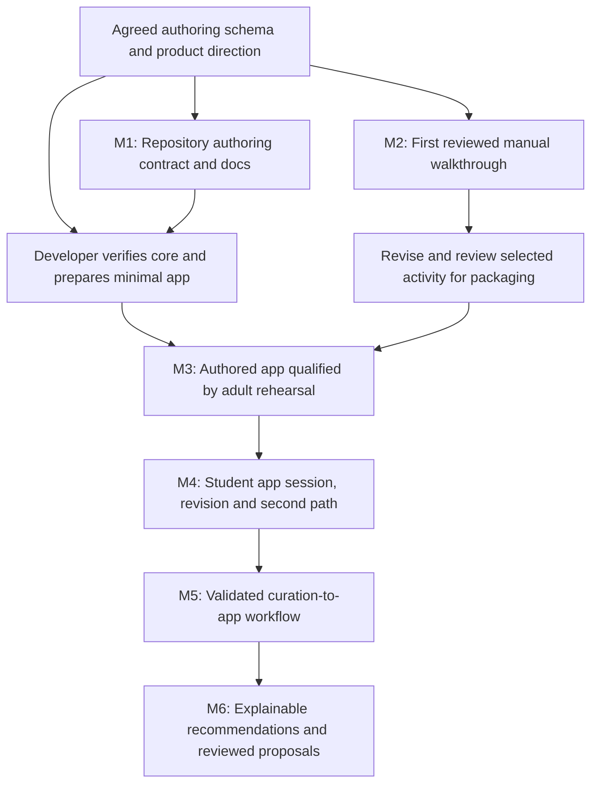

# Lerni — Roadmap

Adopted 2026-09-25 from the revised product direction. Current state was checked at commit `f0af295` (branch `explore/curation-templates`, GitHub PR #2); dated evidence is in [progress.md](./progress.md). Saving this roadmap does not change repository gates or establish that a human review or student test occurred.

## 1. Direction

Educator authoring, product development, and early learning observations should inform one another. Start with reusable path records and one reviewed manual activity. Build the smallest authored local application around that activity, qualify it, and test another path before automating conversion or recommendations.

Study remains maintenance-only. Explore is the active product track. The goal is a useful learning loop, not completion of every future platform capability before the student can participate.

Use dependency-based milestones rather than invented dates or completion percentages. The educator's availability, a merged implementation, and a successful test are different kinds of progress.

## 2. Verified starting point

| Area | State at the checked baseline | What that does and does not establish |
|---|---|---|
| Study | Core CLI implemented; maintenance-only | Existing Feynman workflow, graph, and scheduling are available. Hardening debt remains; Explore does not inherit its runtime or scheduler. |
| Explore lesson foundation | Implemented on main | Domain, canonical encoding, catalog, engine, draft lesson, and visual exist. This is not a complete app. |
| Packaged content | Draft; zero attestations | A reviewable starting example exists. It cannot load through the approved child catalog. |
| Curation templates (branch `explore/curation-templates`, GitHub PR #2) | Open and unmerged when last checked | Legacy v1 draft aids exist on that branch, not on main. The `educator-paths-v1` schema, templates, examples, and checker were added on the same branch in `f0af295`. |
| Product direction | Adopted into this roadmap and [PRD](./PRD.md) | Planning decisions. Repository templates support authoring; filled curriculum copies and learner observations remain separately managed. None of this is an installed application feature. |
| Educator and student activity | Not evidenced by the reviewed repository or planning artifacts | Do not mark interest selection, content approval, a walkthrough, or a student app session complete without genuine evidence. |
| Local Explore application | Not implemented on main | UI, parent controls, session integration, and pilot qualification remain work to do. |
| Conversion, persistence, recommendations | Planned | No active workflow exists merely because detailed specifications have been written. |

The September 6 log recorded 148 passing tests and two expected failures; the September 25 M1 run recorded 197 passing and two expected failures. Test counts are technical evidence, not an app-readiness claim.

## 3. Milestone map

M1 and M2 can proceed in parallel. The educator can use the repository templates or a private workbook with the same columns. The developer can inspect the core, define the reduced app acceptance checks, and build with synthetic content while the educator prepares and tests the activity. A student app session waits for M3.

## 4. M1 — Adopt the direction and establish repository authoring

**Owners:** developer for repository changes; educator for feedback on usability.\
**State:** implemented on `explore/curation-templates` (2026-09-25, GitHub PR #2); merge state is recorded in [progress.md](./progress.md). Educator usability feedback is pending.\
**Dependencies:** agreed schema and current repository baseline. A completed app pilot is not a prerequisite for authoring.

### Work

1. Adopt the revised PRD and roadmap and add a truthful current-status summary to `docs/progress.md`. Preserve historical entries and distinguish product decisions from implementation.
2. Reconcile the master plan, human track, and affected curation specifications. Distinguish educator drafting and manual walkthroughs from application pilot qualification.
3. Create the six `educator-paths-v1` tables: Nodes, Relationships, Connections, Paths, Path Steps, and Sources, with stable IDs and exact field meanings.
4. Provide blank templates, a readable guide, controlled lists, and six varied draft paths. Preserve shared concepts, explicit ordering, branching, and revisits.
5. Add a reproducible offline authoring checker and meaningful tests to the repository change. Committing the change still requires explicit user authorization; creating the files does not authorize Git operations.
6. Correct the legacy template's import promise and Chain-1 approval handoff. Keep the old headers versioned separately and explain that they are not a complete production bundle.

### Completion evidence

- Exact author fields match the agreed workbook and schema guide.
- At least 24 nodes, 30 semantic relationships, 18 teaching connections, six paths, and 24 steps demonstrate generality.
- Sorting rows preserves graph identity and path order; appending records works without fixed row assumptions.
- Duplicate IDs, broken references, invalid statuses, duplicate positions, and inconsistent transitions are detected.
- Later activity details may remain incomplete and visible as such. All examples are draft, and review metadata remains blank.
- The PRD, roadmap, progress summary, and implementation plans agree about what exists and what happens next.

**Excluded:** production importer, publication, activation, runtime changes, genuine human approvals, and changes to Study.

## 5. M2 — Conduct the first reviewed manual activity

**Owners:** educator and parent; student participation is voluntary.\
**State:** awaiting actual selection, preparation, review, and observation evidence.\
**Dependencies:** usable authoring materials and real human review of the selected activity. M1's repository work may still be underway.

### Work

1. Select a current student interest and one concrete learning goal. Reuse an example only when it fits.
2. Outline three to five activities. Give each a target concept, sequence, teaching connection, and goal.
3. Prepare the first activity: opening prompt, activity, understanding check, expected observation, materials, and content revision. Leave later steps as sketches when appropriate.
4. Review the exact material for accuracy, clarity, accessibility, and fit. Resolve relevant questions and record genuine review evidence privately. Existing approval requirements still apply to any packaged app content reused.
5. Run approximately five to ten minutes without waiting for the app; stop earlier if the student wishes.
6. Record brief observations and one proposed revision in the private log. Do not put the student's response or preference in the shared graph.

### Completion evidence

The activity can be identified by path/step/revision; review occurred; the student had the option to stop; the educator can identify what attracted interest, what confused the student, and one change to try. If no session occurs, record it as pending or deferred rather than filling in a result.

**Excluded:** app qualification, automatic mastery inference, persistence, or a requirement to finish the full path.

## 6. M3 — Qualify the smallest authored local application

**Owners:** developer for implementation and technical evidence; educator for material; parent for review and rehearsal.\
**State:** lesson foundation implemented; application work and qualification pending.\
**Dependencies:** repository plans reconciled for the reduced slice, selected activity revised and reviewed, and the existing foundation verified. Development with synthetic fixtures can begin earlier.

### Work

1. Establish a baseline in the supplied source or a local working copy and run relevant lesson-core tests. Address confirmed pilot-relevant engine or catalog issues and document pre-existing failures. Preserve Study and unrelated local edits.
2. Define the exact reduced app acceptance path in the runtime, UI, and verification specifications before relying on it. Retain applicable content, integrity, privacy, session, and parent-control requirements.
3. Manually translate one selected workbook step into one short lesson. Retain path/step/revision mapping separately; do not force the authoring schema to mirror internal presentation steps.
4. Obtain genuine reviews of the packaged wording and assets through the actual application review mechanism. Spreadsheet review status is insufficient.
5. Build the planned local UI around the existing engine: parent Start/Stop/Reset, visible text, necessary curated visuals, authored choices, hints, and completion.
6. Keep session state in memory. Disable AI, speech input/output, accounts, remote assets, sharing, analytics, and persistent student telemetry for this slice.
7. Verify callbacks and session lifetime, late/duplicate event rejection, Stop/Reset, approval checks, resource integrity, no unintended application-managed storage, and no application-initiated outbound requests.
8. Rehearse the entire installed activity as an adult, including interruption and reset. Record what is enabled and the relevant limitations for the parent.

### Completion evidence

The installed application can load the reviewed content, complete the whole activity, and interrupt/reset it correctly. Synthetic tests and adult rehearsal pass for the actual enabled slice. The parent understands and authorizes that experience. Any failed applicable gate blocks student app use.

**Excluded:** live models, microphone access, browser speech, free-form generated responses, persistent learner telemetry, automated import, and graph-guided traversal. Documentation changes alone do not satisfy this milestone.

## 7. M4 — Test the app and demonstrate reuse

**Owners:** student with supervising parent/educator; developer responds to product findings.\
**State:** pending M3 and actual participation.\
**Dependencies:** M3 for every enabled app feature; reviewed content for every activity used.

### Work

1. Conduct the first student app session with the revised activity. Allow stopping without pressure to complete.
2. Record product usability separately from learning observations. Identify whether confusion concerns wording/concept, controls, presentation, or both.
3. Revise one clear issue and apply the required content or technical rechecks before reuse.
4. Test a second path from a different interest with at least one shared concept. Reuse the same authoring schema and lesson engine.
5. At the next appropriate contact, ask a brief recall or explanation question. Record an actual observation without inventing a schedule, response, or result.

### Completion evidence

The team has observations from a qualified app session and a second path, can distinguish content and interface issues, and can demonstrate reuse without special-case schema or engine changes. A correct answer alone is not a mastery label. If the family defers follow-up recall, record that limitation rather than treating missing data as success.

**Decision:** continue, revise, or pause based on usefulness and willingness to participate. Do not expand the feature set simply to make the roadmap appear complete.

## 8. M5 — Build a validated curation-to-app workflow

**Owners:** developer with educator review of previews.\
**State:** planned.\
**Dependencies:** manual handoff exercised and second-path reuse understood through M4; an agreed delivery mapping and approval design.

### Work

1. Specify how the six authoring tables map to lesson content, facts, sources, assets, and path/step identity. Resolve the older v1 delivery-schema differences explicitly.
2. Keep the small authoring checker distinct from the production parser/compiler and its trust boundary.
3. Implement bounded, deterministic validation and conversion with educator-readable issues and a preview of the exact selected activity.
4. Preserve content revisions and invalidate the applicable approval when reviewed wording or assets change.
5. Keep draft editing separate from publishing. Incomplete records do not silently become lessons; import does not confer approval.
6. If curriculum persistence, staging, installation, or activation is introduced, implement the corresponding integrity, recovery, and authorization requirements before using it.

### Completion evidence

Valid selected content transfers predictably with traceable identifiers and review evidence; malformed or incomplete publication inputs are rejected; the educator can inspect the result before it becomes available in the app. A round trip or update preserves identities and detects meaningful content changes.

**Excluded:** persistent student telemetry merely because a curriculum database now exists, automatic cloud sheet synchronization, and autonomous graph mutation.

## 9. M6 — Recommend reviewed options and support reviewed graph growth

**Owners:** developer for recommendation/proposal mechanics; educator for educational decisions; parent for student-facing selection.\
**State:** planned.\
**Dependencies:** M5 and a reviewed graph with usable activities and traceable evidence.

### Work

1. Recommend existing reviewed connections and activities first. Explain the origin, proposed destination, educational rationale, and relevant readiness guidance.
2. Leave the next activity under adult selection and the ordinary content approval gate. Do not infer mastery from one answer or automatically execute a path.
3. Add a proposal workflow for missing concepts or useful connections: search for duplicates, record rationale/context/references, and present accept/revise/merge/defer/reject decisions.
4. Give accepted additions stable ordinary IDs and retain their provenance. Review any child-facing activity built from them separately.
5. Use generalized educational findings in curriculum. Keep student-specific evidence in private learner records under the appropriate later data controls.

### Completion evidence

Suggestions are explainable. A proposed addition cannot silently alter reviewed graph records, change an active lesson, or expose unreviewed material. Duplicate handling and all educator dispositions work. Tests distinguish a proposal, an accepted graph record, and an approved activity.

Adaptive recommendation experiments, automated scheduling, and broad personalization remain separate later decisions.

## 10. Optional capabilities after evidence warrants them

These are not prerequisites for M1–M4 and are not promises of delivery dates:

| Capability | Additional requirements before use |
|---|---|
| Persistent learner records | Explicit parent choice, data minimization, private storage, retention, export, deletion, managed wipe, and verified lifecycle behavior. |
| Tutor generation | Qualified replaceable adapter, bounded scope, grounding and input/output checks, required harm-gate capability, authored fallback, and parent authorization. The model never owns progression. |
| Speech output | Verified routing and behavior, visible text retained, parent control, and qualification for the enabled environment. |
| Speech input | Qualified transcription, explicit understanding of any external raw-audio routing, scoped microphone access, editable transcript, managed temporary files, and cleanup behavior. |
| Spaced revisiting | Evidence that the chosen scheduling semantics fit Explore; no automatic dependence on Study's SM-2 model. |
| Classroom or public use, accounts, hosting | Separate product scope and privacy/security review; outside the current family pilot. |

A newly enabled capability requires a new review of applicable app acceptance checks. Passing an authored-only rehearsal does not qualify AI or voice.

## 11. Relating milestones to existing plan files

The numbered files in `plans/prs/` are internal work packages, not GitHub pull-request numbers. In particular, plan **PR-02** is the lesson core already on main, while **GitHub PR #2** is the unmerged curation-template change.

| Existing work package | Revised treatment |
|---|---|
| PR-01 documentation | Reopen alignment work for this direction; do not describe the old documents as fully current. |
| PR-02 lesson core | Record implementation as delivered; content approval, focused hardening, and application integration remain separate. |
| PR-03 runtime boundary, PR-04 safety/tutor, PR-06 UI, PR-08 gate | Identify and implement the subset required for M3, then verify it. Defer optional capability machinery without bypassing protections required by the enabled slice. |
| PR-05 telemetry | Defer persistent student data from M3. Retain and complete its requirements before introducing persistence later. |
| PR-07 audio and PR-07A adapters | Optional later capabilities, each with its own qualification. They do not block the authored slice merely because they are in the old sequence. |
| PR-09 curation | Split early authoring templates/checks at M1 from strict delivery conversion at M5. Reconcile the schema before implementing the latter. |
| PR-10 curriculum persistence | Introduce when required by M5's chosen publication workflow; retain applicable integrity and activation controls. |
| PR-11 recommendations | Implement existing-reviewed-option suggestions and an explicit proposal/review extension at M6. Do not assume the old plan already implements graph growth. |

The agent adopting this roadmap must update contradictory dependency statements and planned-versus-implemented labels. Product intent belongs here and in the PRD; exact technical contracts remain in the specifications. An unresolved contract conflict is a design task, not permission to ignore an existing gate.

## 12. Progress reporting

Maintain a short current-state table at the top of `docs/progress.md` and append dated evidence below it. Keep the historical log intact.

| Work item | Owner | State | Evidence | Next action or blocker |
|---|---|---|---|---|
| Example: lesson engine | Developer | Implemented | Actual commit and relevant test evidence | Verify pilot-relevant behavior and integrate |
| Example: first activity review | Educator/parent | Pending unless genuinely performed | Actual reviewed content revision and approval record | Review exact wording and materials |
| Example: first student session | Parent/educator | Pending unless genuinely performed | Private observation record reference, without learner details | Complete relevant readiness checks |

Use distinct states such as planned, in progress, implemented, awaiting review, technically qualified, observed in a session, and deferred. Do not collapse these into a single “done” flag. Where detailed learner evidence is private, record only that the authorized evidence exists and its non-identifying reference; do not publish its contents.

Document adoption is a planning update. A merged template PR is an authoring delivery. A passed test is technical evidence. A real human review or student session is a separate event. Record each only when it happens.

## 13. Study maintenance and parked work

Preserve the existing Study CLI, question/answer versions, SQLite schema compatibility, concept graph, Feynman flow, and SM-2 behavior. Address confirmed defects and scoped hardening without using Explore work to launch new Study features.

Study's AI agents/skills, analytics and export, visualization, native/mobile apps, synchronization, and additional agent types remain parked. Retain their detailed historical design/backlog references when adopting this roadmap so they remain recoverable; do not present them as active prerequisites or delete them as an incidental cleanup.

## 14. Immediate handoff

M1's repository work — documentation adoption, `educator-paths-v1` authoring artifacts and checks, and the legacy template repair — is on the GitHub PR #2 branch, described in [progress.md](./progress.md). Next:

- **Educator and parent (M2):** choose a fitting interest and goal, sketch three to five activities with the [templates](../curation/templates/educator-paths-v1/README.md), prepare and genuinely review the first, and run the optional walkthrough described in [`plans/human-track.md`](../plans/human-track.md).
- **Developer (toward M3):** reconcile the runtime, UI, and verification specifications for the reduced authored slice, then build it against synthetic content. The work-package sequence lives in the [master plan](../plans/cursor_master_plan.plan.md).

Field-level rules are in [`plans/specs/08c-educator-path-authoring.md`](../plans/specs/08c-educator-path-authoring.md); product requirements in the [PRD](./PRD.md).

## Appendix A — Study track detail (parked, preserved)

The pre-revision Study track is kept verbatim below so the parked work stays recoverable. It is not an active prerequisite.

### Study Track

**Status**: Phase 1 complete and maintenance-only. Phase 1 hardening items in
[`todo.md`](./todo.md) remain open — feature-complete is not the same as hardened.

#### Phase 1: MVP (Core System)

**Goal**: Fully functional local study system without AI

##### Data Layer
- [x] SQLite database setup (`~/.lerni/lerni.db`)
- [x] Concept model (knowledge graph nodes)
- [x] ConceptEdge model (typed relationships: parent, prerequisite, related)
- [x] Question model with SM-2 schedule state
- [x] Answer model (immutable Feynman snapshots)
- [x] Review model with SM-2 state

##### Feynman Workflow
- [x] `study new` - Full 4-step flow
- [x] `study new --quick` - Quick capture (step 1 only)
- [x] `study edit` - Minor edits without versioning
- [x] `study snapshot` - Create new version

##### Review System
- [x] SM-2 algorithm implementation
- [x] `study review` - Review session workflow
- [x] `study skip` - Skip and reschedule
- [x] `study today` - Daily summary

##### Organization
- [x] `study list` - List with filters (concept, due)
- [x] `study search` - Full-text search
- [x] `study show` / `study history` - View question and answers
- [x] `study meta` - Update metadata
- [x] `study assign` - Assign question to concept
- [x] `study concept new/list/show/link/unlink/delete` - Knowledge graph management

##### Notifications
- [x] `study notify` - macOS notification
- [x] `study notify --setup` - Cron setup instructions

---

#### Phase 2: AI Agents

**Status**: maintenance-only — parked while Explore is active. Not deleted; not scheduled.

**Goal**: Optional AI-assisted coaching

##### Infrastructure
- [ ] AISession model for transcript storage
- [ ] API key configuration — operator-selected, credential reference only
- [ ] Prompt file loading and variable substitution

##### Beginner Agent
- [ ] Socratic mode - Probing questions
- [ ] ELI5 mode - Confused beginner roleplay
- [ ] Analogy mode - Push for real-world examples
- [ ] 3-5 turn session management

##### Expert Agent
- [ ] Rigor levels 1-5
- [ ] Gap identification
- [ ] Grade suggestion

##### CLI Integration
- [ ] `--ai` flag for review command
- [ ] `--mode` and `--rigor` options
- [ ] `study coach` - Standalone agent sessions
- [ ] `study sessions` / `study session` - View transcripts

---

#### Phase 3: Analytics & Export

**Status**: maintenance-only — parked while Explore is active. Not deleted; not scheduled.

**Goal**: Insights and data portability

- [ ] `study stats` - Global statistics
- [ ] `study stats <id>` - Per-topic analytics
- [ ] Grade trend visualization (ASCII charts)
- [ ] `study export --all` - Full JSON backup
- [ ] `study import` - Restore from backup
- [ ] `study export-graph` - Knowledge graph JSON

---

#### Phase 4: Visualization

**Status**: maintenance-only — parked while Explore is active. Not deleted; not scheduled.

**Goal**: Rich visual interfaces

- [ ] Plotly HTML reports for grade progression
- [ ] Neo4j export for graph visualization
- [ ] launchd integration (persistent notifications)
- [ ] Configurable reminder times

---

#### Phase 5: Future Ideas

**Status**: maintenance-only — parked while Explore is active. Not deleted; not scheduled.

**Documented for later consideration**:

##### Native Apps
- macOS menu bar app (quick review access)
- iOS companion app (review on mobile)
- Interactive mindmap UI

##### Additional Agents
- **Interviewer Agent** - Technical interview simulation
- **Connector Agent** - Suggests links between topics

##### Advanced Features
- Rich media support (images, LaTeX)
- Local LLM support (ollama) for offline AI
- Collaborative features (share topic packs)

## Appendix B — Superseded Explore phase map

Before this revision, Explore was sequenced as Phase 1A (deterministic safe slice), 1B (push-to-talk), 2 (content and parent curation, gated on a first pilot), and 3 (retention and recommendation). The revised milestones replace that sequence:

| Former phase | Now |
|---|---|
| 1A deterministic safe slice | Lesson core delivered; the reduced authored app slice is M3. Telemetry, policy/grounding, tutor contract, and read-aloud move to optional later capabilities (section 10). |
| 1B push-to-talk | Optional later capability (section 10). |
| 2 content and parent curation | Split: early authoring at M1 (no pilot gate), strict conversion at M5, curriculum graph with M5–M6. |
| 3 retention and recommendation | M6 plus optional spaced revisiting (section 10). |
