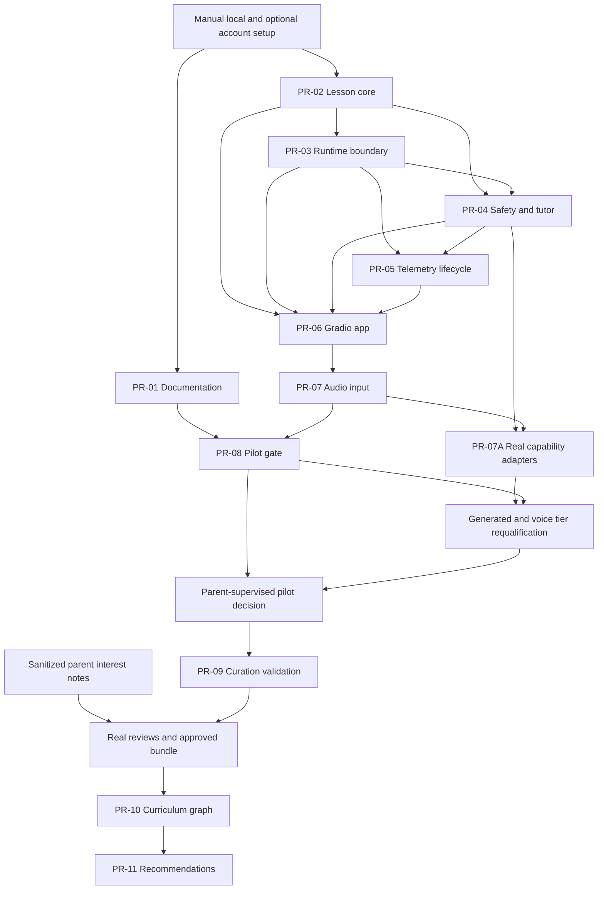
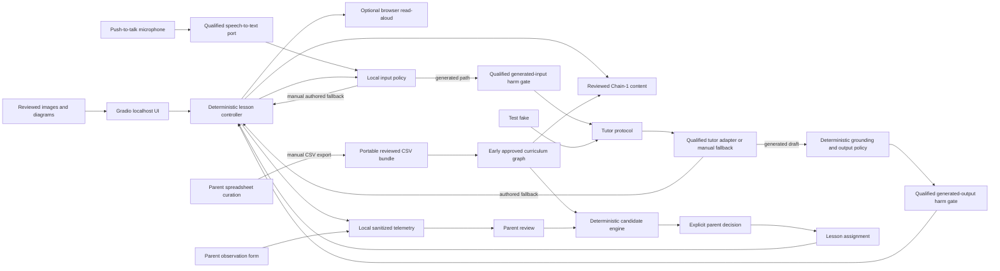

# Lerni Explore Master Implementation and PR Index

## Critical review

### Keep
- Preserve Study as a feature-frozen mode in the same repository; its Phase-1 CLI is functional and should remain compatible.
- Start with one short, educator-authored car-to-science lesson and test whether it creates curiosity before building the garage, parent portal, or broader graph.
- Keep curriculum human-reviewed and make the application—not the LLM—select lesson content and advance progress.
- Keep the first prototype local, parent-supervised, and data-minimized, with an account-free authored baseline and explicit qualification for any optional service account; parents control retention, export, and deletion.

### Correct
- “Study is finished” means feature-complete, not hardened: only SM-2 has automated coverage, while CLI/database coverage and quality checks remain open.
- “Reuse the engine” is a target architecture, not current reality. `src/lerni/models.py` provides `Concept`/`ConceptEdge` storage semantics, but no lesson traversal exists; agent runtime is absent; SM-2 is irrelevant to Week 1.
- One graph edge should not automatically equal one tutor turn. Existing `prerequisite` edges mean “concept requires prerequisite,” while a lesson step means “teach this next”; conflating domain relationships with pedagogy will corrupt both. Week 1 therefore uses an explicit lesson sequence and defers graph integration.
- Hop count is a useful authoring heuristic, not a validated difficulty metric; authored edge granularity determines the count.
- The draft Chain-1 line “that 0–60 number has a name: acceleration” is scientifically wrong. A 0–60 figure is elapsed time; acceleration is change in velocity over time. The fact sheet will use the corrected distinction and stable sources, without mutable leaderboard claims.
- Safety and grounding cannot wait until Week 2 if a child uses Week 1. Provider safety behavior is not an application safety boundary, so this prototype will use bounded content, deterministic local policy checks, buffered output, a turn cap, and parent supervision; it will not claim production-grade moderation or COPPA compliance.
- Audio output is cheap enough for the first usable build through a runtime-detected browser speech capability. Audio input is a separate concern and should follow immediately through an isolated, qualified speech-to-text adapter rather than block the lesson core.
- FastAPI, NetworkX, shared Study-database state, token streaming, Render, and the garage do not contribute to the first learning signal and are deferred.

## Decisions

- Locked: one repository, two modes; Study is maintenance-only and Explore is active.
- Locked: Gradio + replaceable tutor capability + app-owned lesson state + Chain-1 grounding/output gate.
- Locked: generated tutor use for a child additionally requires a qualified input/output harm gate; otherwise authored fallback remains active.
- Locked: no plan file assumes an available coding agent, model, provider, credential, speech engine, accelerator, or orchestration tool; runtime adapters are selected through explicit environment qualification.
- Locked: the first child session includes curated visuals and text/choice interaction, and offers parent-enabled browser read-aloud only when qualified/supported; it does not accept child image uploads.
- Locked: push-to-talk input follows the core immediately, using Gradio microphone capture and a replaceable speech-to-text contract; the selected adapter's local/external routing and retention are reviewed by parents before use.
- Locked: localhost only (`127.0.0.1`, no share URL), buffered responses, no public deployment.
- Locked: retain sanitized turns, lesson events, and parent observations in a separate local Explore SQLite database with no child name; provide session-level delete and JSON export controls. Do not add cloud analytics or retain audio.
- Locked: parent curation begins in portable CSV-backed spreadsheet templates compatible with Google Sheets; interests, nudges, facts, graph edges, and lesson order remain separate records, and only approved content primes the active graph.
- Locked: preserve all pre-existing uncommitted work, including `.claude/`; make no commits.
- Deferred: integration with the Study database, garage/mastery, Spanish, child image uploads, deployment framework/hosting, graph libraries, automatic sheet synchronization, and any non-family access.

## How to use this plan

- This file owns sequence, dependencies, manual gates, and PR index.
- Each PR has a separate implementation file below.
- Detailed technical contracts remain in the numbered specification files; PR-07A is intentionally the combined deployment-specific contract/implementation template because provider details cannot enter core specs.
- PR labels describe future review units; they do not authorize a commit, push, branch, or hosted pull request.
- Implementation remains uncommitted until the user explicitly authorizes Git operations.
- No plan assumes a particular implementation agent, model, provider, credential store, or orchestration product. The host must qualify the filesystem, process, browser, and localhost controls required for child use; an unsupported platform blocks that tier rather than receiving weaker claims.

## Manual setup tracks

1. **[Accounts, credentials, runtime, and parent launch setup](./runbooks/manual-setup.md).**
   - The fallback-only slice needs no service account or credential.
   - External tutor, STT, or additional-safety capabilities require separate parent-owned account/terms/retention/billing/key qualification.
   - If no compatible plugin exists, the environment implements a separate recorded adapter package; fake backends do not satisfy a real LLM/STT pilot.
   - Google Sheets is optional and needs no Google API/OAuth/service account; local CSV is authoritative.
   - Credential values never enter TOML, Git, IPC JSON, telemetry, exports, logs, or sheets.

2. **[Private CSV/Google Sheets data priming](./runbooks/data-priming.md).**
   - Parents may draft sanitized interest/nudge notes while PRs 01–08 proceed; they populate the exact private bundle after PR-09 templates/validator exist.
   - Real source, science, child-content, accessibility, and parent reviews are required before approval.
   - The filled family workbook/bundle stays private and untracked.
   - Activation and recommendation priming occur only at their later gates.

## PR index

1. **[PR-01 — Explore-first product documentation](./prs/01-documentation.md).**
   Markdown-only alignment; preserves existing user edits.
2. **[PR-02 — Reviewed lesson core and Chain-1 content](./prs/02-lesson-core.md).**
   Immutable lesson types, strict package catalog, approved facts/visual, deterministic state.
3. **[PR-03 — Runtime profile and capability process boundary](./prs/03-runtime-boundary.md).**
   Private paths, credential references, bounded helper protocol, parent guard, readiness primitives.
4. **[PR-04 — Deterministic safety, grounding, and tutor service](./prs/04-safety-tutor.md).**
   Input/output policy, manual fallback, optional tutor/additional-safety contracts.
5. **[PR-05 — Local telemetry and data lifecycle](./prs/05-telemetry-lifecycle.md).**
   Sanitized SQLite, observations, export, retention, deletion, and registered managed-family-data wipe.
6. **[PR-06 — Local Gradio app, bootstrap, and read-aloud](./prs/06-gradio-app.md).**
   Readiness-gated localhost UI, curated visual, typed/choice interaction, parent controls.
7. **[PR-07 — Push-to-talk speech input](./prs/07-audio-input.md).**
   Qualified STT port, strict WAV boundary, editable preview, cleanup, typed fallback.
7A. **[PR-07A — Deployment-specific real capability adapters](./prs/07a-capability-adapters.md).**
   Conditional provider-specific distributions for real tutor, mandatory safety, and STT; required for generated/voice eligibility, never for the authored baseline.
8. **[PR-08 — First-slice integration and pilot gate](./prs/08-pilot-gate.md).**
   Concrete claim/evidence map, privacy/distribution/regression checks, supervised-pilot runbook.
9. **[PR-09 — Curation templates and strict CSV validation](./prs/09-curation-csv.md).**
   Portable draft templates, exact offline parser/validator, no database activation.
10. **[PR-10 — Curriculum persistence, graph, and publication](./prs/10-curriculum-graph.md).**
    Immutable batches, compile/publish/install verification, explicit activation, graph/binding.
11. **[PR-11 — Parent recommendations, assignments, and feedback](./prs/11-recommendations.md).**
    Parent scope/readiness, deterministic candidates, crash-safe assignments, UI/lifecycle extension.

## Dependency and gate sequence

PR-07 may remain disabled at runtime if no STT capability qualifies, but its typed fallback and cleanup contract must still pass before PR-08. PR-07A is conditional for an authored-only rehearsal but required before PR-08 can claim generated tutor or voice-input eligibility; it may be split into separately reviewed adapter distributions. PRs 09–11 do not begin merely because code is available; the parent pilot decision and real content-review gates are required.

PR-08 reports cumulative eligibility rather than calling every launch “multimodal”: authored visual/typed interaction can be rehearsed first; actual LLM interaction additionally requires real qualified tutor and mandatory safety plugins; the complete audio-input/output target additionally requires real qualified STT/managed microphone plus separately qualified browser read-aloud.

## Architecture

When a qualified tutor is available, it may phrase an explanation or answer a bounded car-science question. It cannot select edges, mark mastery, unlock content, reveal/grade the deterministic check, or bypass the output gate. Browser read-aloud is optional. Microphone audio passes only to the selected speech-to-text capability; raw voice is routed before transcript redaction, and Lerni attempts immediate cleanup only inside its managed recording boundary before the editable transcript follows the normal input path.

## Technical specification index

1. **[Execution contract and environment qualification](./specs/00-execution-contract.md).** Preserve the working tree, bind portable command variables, and qualify required versus optional environment tiers.

2. **[Runtime profile and bootstrap](./specs/00a-runtime-bootstrap.md).** Parse one strict provider-neutral profile, derive private paths, qualify capability metadata, enforce call deadlines, authorize parent controls, and assemble deterministic fallbacks.

3. **[Documentation alignment](./specs/01-documentation.md).** Rewrite product identity and priorities while preserving all existing uncommitted AI-skill, iOS, hook, and Study content.

4. **[Lesson domain and reviewed Chain-1 content](./specs/02-lesson-core.md).** Implement immutable types, a strict TOML catalog, corrected acceleration content, an accessible curated SVG, deterministic intro/teach/check/hint/complete transitions, and installed-package verification.

5. **[Safety, grounding, and tutor boundary](./specs/03-safety-tutor.md), with [normative policy algorithms](./specs/03a-policy-algorithms.md) and [exact harm-probe fixture](./specs/03b-harm-probe-cases.md).** Implement best-effort sanitization, deterministic policy, exact rules/fixtures, fact/number checks, typed tutor contracts, authored fallback, and the mandatory qualified harm gate for any generated child-facing tutor.

6. **[Local telemetry and parent controls](./specs/04-telemetry.md).** Add a separate Explore SQLite schema for sanitized turns, structured events, parent observations, retention, export, and transactional deletion; exclude child names, raw rejected content, audio, arbitrary JSON, credentials, and provider identifiers.

7. **[Gradio UI, curated visual, and read-aloud](./specs/05-gradio-ui.md).** Build pure presenter callbacks first, then a localhost-only Gradio composition with deterministic controls, optional read-aloud, accessible fallbacks, and parent supervision controls.

8. **[Push-to-talk audio input](./specs/06-audio-input.md).** Add plugin qualification, bounded managed recordings, strict WAV validation, cleanup in every path, transcript preview/edit, and the same policy pipeline as typed input.

9. **[Deployment-specific real capability adapters](./prs/07a-capability-adapters.md).** Implement/install separately recorded provider-specific tutor, mandatory safety, and STT distributions only after manual service selection; keep provider details and SDKs outside core.

10. **[First-slice verification and parent-supervised pilot](./specs/07-verification.md).** Capture baseline, preserve red/green evidence, run focused/full/static/distribution checks, exercise privacy and audio failures, verify Study compatibility, qualify selected adapters, and run a deliberately bounded family pilot.

11. **[Portable spreadsheet curation and graph priming](./specs/08-graph-recommendations.md), [curriculum persistence](./specs/08a-curriculum-persistence.md), and [recommendation/feedback](./specs/08b-recommendation-feedback.md).** Provide exact portable workbook/CSV tabs and columns, privacy rules, immutable types, SQL/transactions, validation/import contracts, an early approved graph, deterministic lesson compilation, local observation aggregation, and transparent parent-approved recommendations.

## Execution boundary

- The account-free authored first slice is PRs 01–08 plus technical plans 00–07. PR-07A is conditional first-slice work that may be skipped for authored rehearsal but is mandatory—and followed by a PR-08 eligibility rerun—before any generated-tutor or voice-input claim.
- PR-06 enables a parent/developer fallback-only UI preview; no session is called an LLM or voice pilot until PR-08’s corresponding real-capability eligibility level passes.
- Parents may privately draft the workbook in parallel, but no family-filled copy is tracked.
- PR-09 starts only after the first-slice technical gate and parent decision to continue.
- PR-10 additionally requires real content reviews and an approved exact bundle.
- PR-11 additionally requires a verified active curriculum; observations/readiness may remain empty/unknown rather than fabricated.
- Every PR runs focused tests plus the containing regression set before handoff.
- Graph-specific and full regression verification repeat after PRs 10 and 11.
- No step commits, pushes, publicly deploys, opens a hosted PR, or sends a message on the user’s behalf without separate explicit authorization.